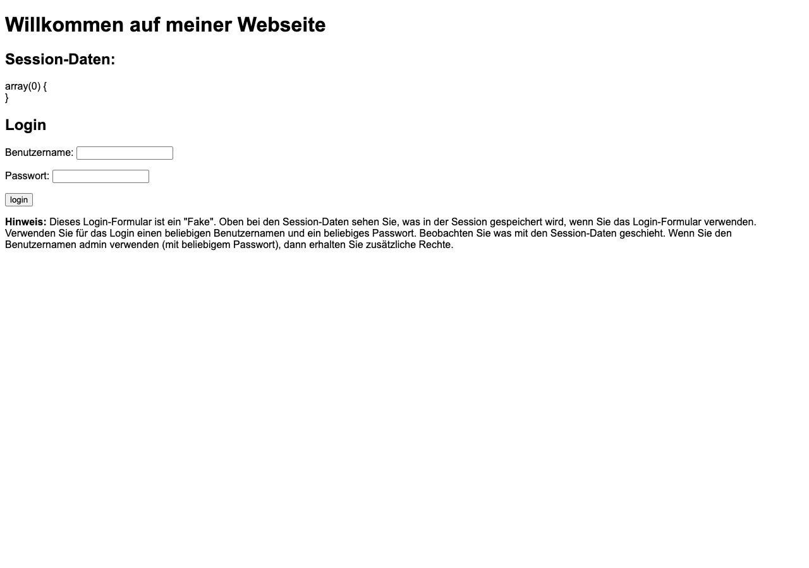
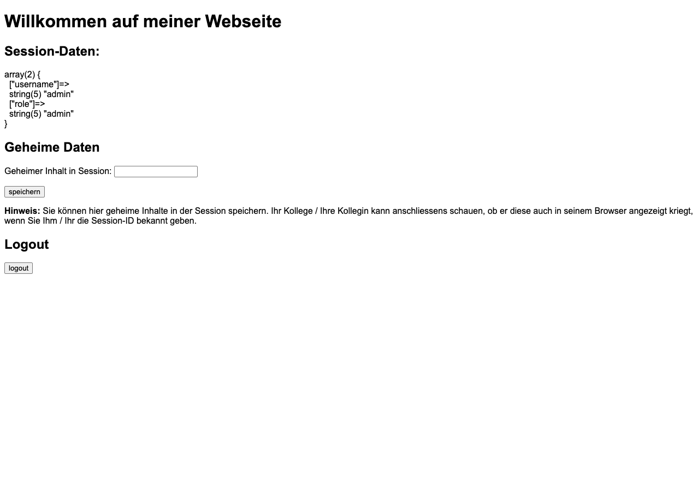
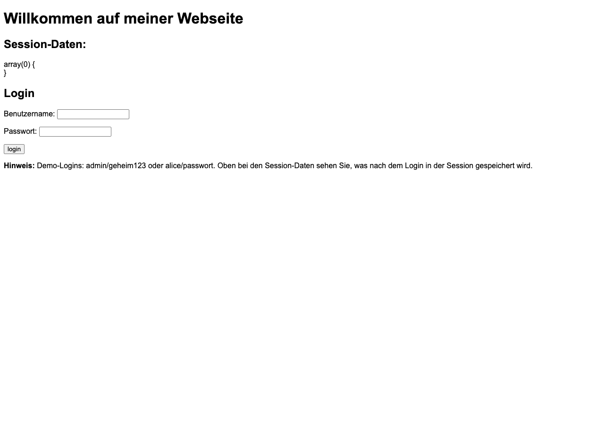
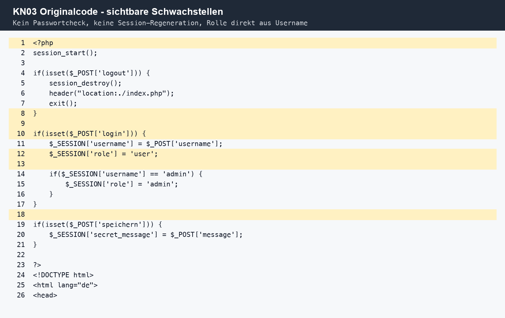
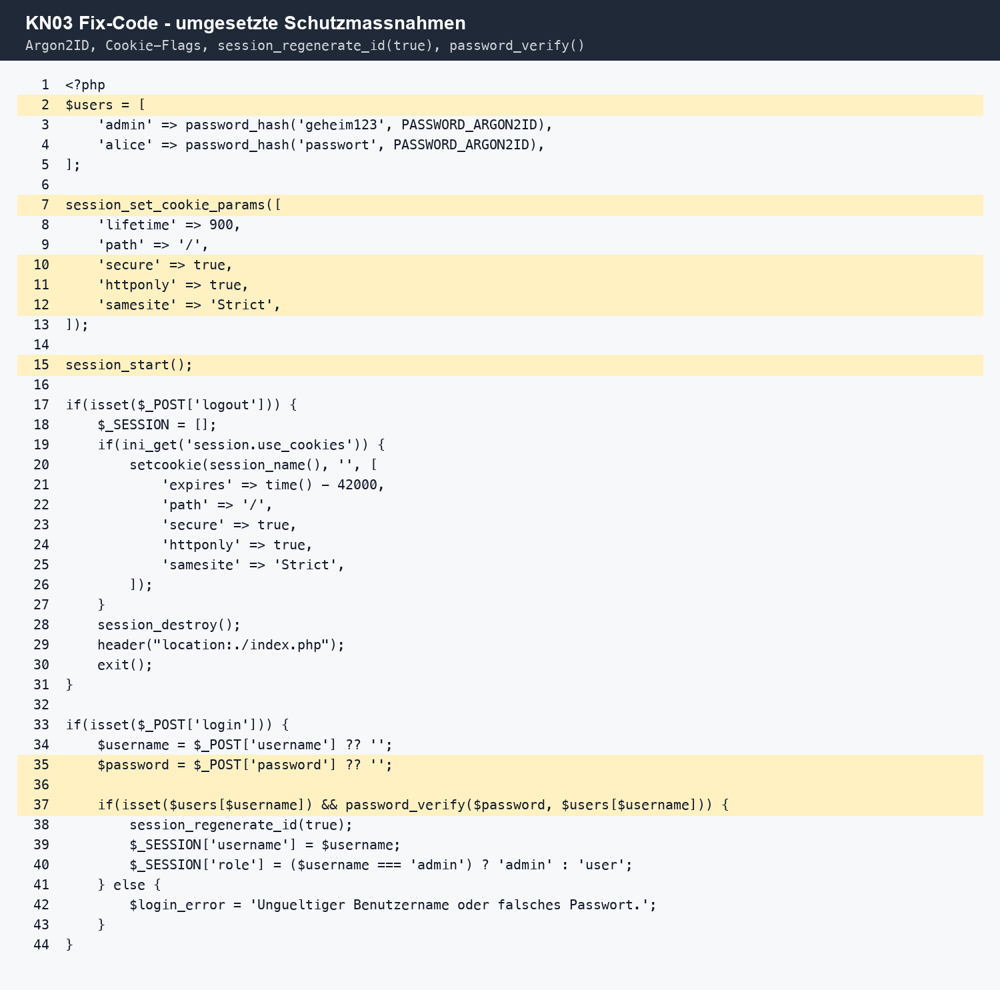
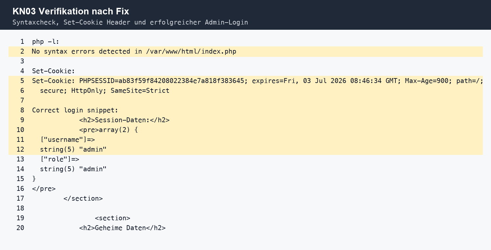
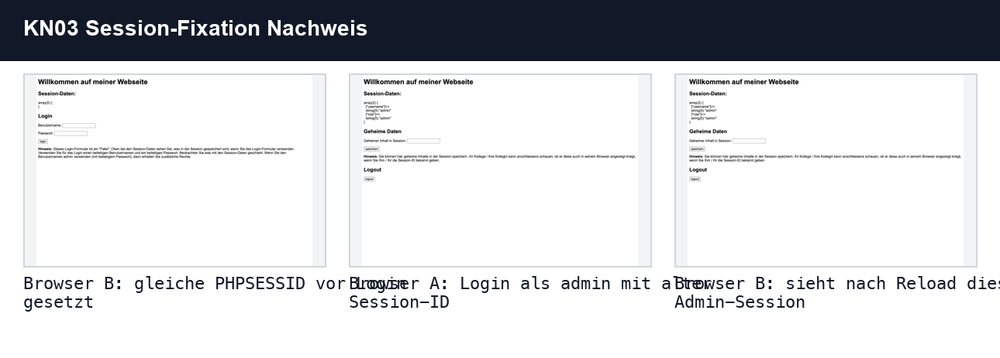
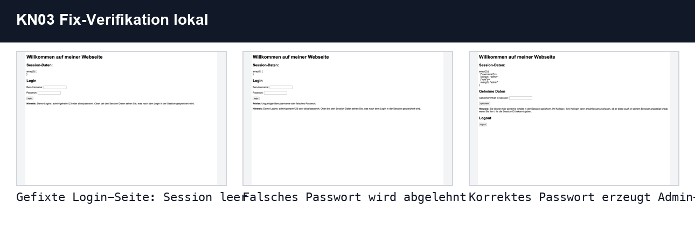
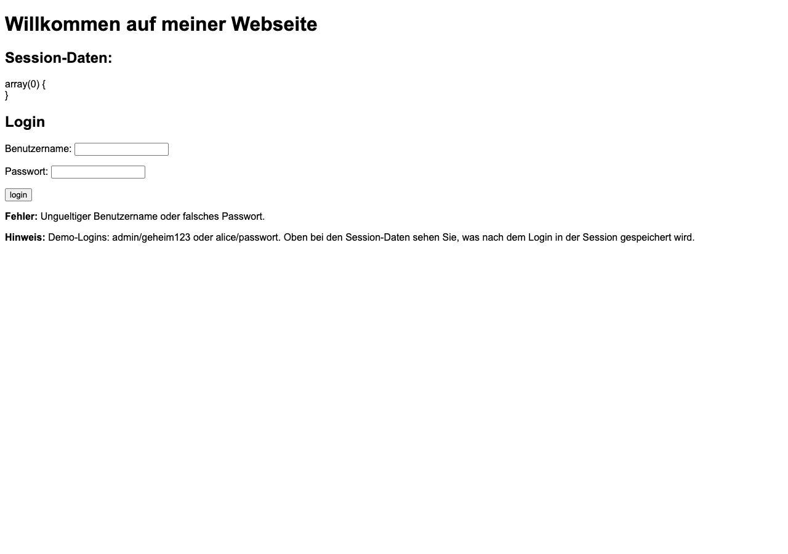

# KN03 - Sessionhandling & Authentifizierung absichern

> [!info]
> Modul 183 - Applikationssicherheit implementieren  
> Umgebung: PHP 8.2 Apache Docker-Container auf AWS EC2, Port 80  
> Live-Verifikation: 03.07.2026  
> Status dieser Doku: A-E dokumentiert, Fixes live auf EC2 eingespielt

---

## Uebersicht

| Teil | Thema | Status | Nachweis |
|---|---|---:|---|
| A | Port 80 und PHP-App | Erledigt | App unter `http://18.234.220.80/` erreichbar |
| B | Sicherheitsanalyse `index.php` | Erledigt | Fuenf Schwachstellen beschrieben |
| C | Session-Fixation-Angriff | Erledigt | Zwei Browser-Sessions mit gleicher `PHPSESSID` |
| D | Fixes | Erledigt | `session_regenerate_id(true)`, Argon2ID, Cookie-Flags |
| E | MFA-Faktoren | Erledigt | Tabelle und Antworten ausgefuellt |

---

## Screenshots und Belege

| Datei | Bedeutung |
|---|---|
| `kn03-app-start.png` | Laufende App vor dem Fix im Browser mit EC2-IP |
| `kn03-fixation-before-login-browser2.png` | Browser B vor dem Login mit gesetzter gleicher Session-ID |
| `kn03-fixation-browser1-after-login.png` | Browser A nach Login als `admin` |
| `kn03-fixation-browser2-after-reload.png` | Browser B sieht nach Reload dieselbe Admin-Session |
| `kn03-fixed-login-page.png` | Login-Seite nach Fix mit echten Demo-Credentials |
| `kn03-local-fixed-login-empty.png` | Lokal nachgestellte gefixte Login-Seite ohne Session |
| `kn03-local-wrong-password.png` | Falsches Passwort wird nach dem Fix abgelehnt |
| `kn03-local-admin-login-success.png` | Korrektes Passwort erzeugt Admin-Session |
| `kn03-original-code-vulnerabilities.png` | Originalcode mit markierten Schwachstellen |
| `kn03-fixed-code-security-fixes.png` | Fix-Code mit markierten Schutzmassnahmen |
| `kn03-fix-verification-output.png` | Terminal-/Headernachweis der Fix-Verifikation |
| `kn03-session-fixation-flow.png` | Kompakter Vergleich des Session-Fixation-Ablaufs |
| `kn03-fixed-login-flow-local.png` | Kompakter Vergleich der lokalen Login-Fix-Verifikation |
| `kn03-fix-verification.txt` | `php -l`, `Set-Cookie` Header und erfolgreicher Login nach Fix |
| `AufgabeSource/index_original.php` | Originalversion der verwundbaren Datei |
| `AufgabeSource/index.php` | Gepatchte Version der Datei |


*Abbildung 1: PHP-App laeuft auf Port 80 der EC2-Instanz.*


*Abbildung 2: Browser B sieht nach Reload die Admin-Session von Browser A.*


*Abbildung 3: App nach Fix mit echten Demo-Logins.*


*Abbildung 4: Originalcode mit den zentralen Luecken: kein Passwortcheck, keine Session-Regeneration, Rolle direkt aus Username.*


*Abbildung 5: Fix-Code mit Argon2ID, Cookie-Flags, `password_verify()` und `session_regenerate_id(true)`.*


*Abbildung 6: Verifikation nach Fix: Syntaxcheck, `Set-Cookie`-Header und erfolgreicher Login.*

---

## A) Sicherheitsgruppe erweitern und App deployen

Die PHP-App wurde aus dem Modul-Repository auf der EC2-Instanz gestartet:

```bash
cd ~/m183/m183-gitlab-vaj
docker run -d \
  --name m183-session \
  -p 80:80 \
  -v "$PWD/2 Sessionhandling, Authentifizierung und Autorisierung/Sessionhandling/AufgabeSource":/var/www/html \
  php:8.2-apache
```

Der Container laeuft auf Port 80:

```text
php:8.2-apache    m183-session    0.0.0.0:80->80/tcp
```

HTTP-Test auf der Instanz:

```text
HTTP/1.1 200 OK
Server: Apache/2.4.67 (Debian)
X-Powered-By: PHP/8.2.32
```

Die Security Group der Instanz heisst laut EC2-Metadata `launch-wizard-1`. Port 80 ist praktisch offen, da die App im Browser unter `http://18.234.220.80/` erreichbar ist.

> [!note]
> Der geforderte AWS-Konsole-Screenshot mit sichtbarer Regel `HTTP TCP 80 My IP` muss in der AWS-Konsole gemacht werden, falls er fuer die Abgabe zwingend als GUI-Screenshot verlangt wird. Technisch ist Port 80 durch den erfolgreichen Browser- und HTTP-Test belegt.

---

## B) Sicherheitsluecken in der App analysieren

Analysierte Datei: `AufgabeSource/index_original.php`

| Nr. | Sicherheitsluecke | Problem | Verletztes Schutzziel / OWASP |
|---:|---|---|---|
| 1 | Passwort wird nicht geprueft | Im Original setzt jeder POST mit `login` direkt `$_SESSION['username']`. Das Passwortfeld ist wirkungslos. | Confidentiality, Integrity / OWASP A07 Identification and Authentication Failures |
| 2 | Session-ID wird nach Login nicht erneuert | Ein Angreifer kann eine bekannte `PHPSESSID` vorgeben. Nach dem Login bleibt diese ID gueltig. | Confidentiality, Integrity / OWASP A07 |
| 3 | Rolle wird nur aus dem Benutzernamen abgeleitet | Wer als Benutzername `admin` eintraegt, erhaelt Admin-Rechte. Es gibt keine echte Berechtigungspruefung. | Integrity / OWASP A01 Broken Access Control |
| 4 | Cookie-Flags fehlen | Vor dem Fix war `PHPSESSID` ohne `HttpOnly` und ohne `Secure`; `SameSite` war nicht explizit `Strict`. | Confidentiality, Integrity / OWASP A05 Security Misconfiguration |
| 5 | Kein CSRF-Schutz | Login, Speichern und Logout haben keine CSRF-Token. Ein fremdes Formular koennte Requests im Browser des Opfers ausloesen. | Integrity / OWASP A01/A05 |

Zusaetzliche Beobachtung: `var_dump($_SESSION)` zeigt Session-Daten direkt im Browser. Das ist fuer diese Uebungs-App nuetzlich, waere produktiv aber eine Informationspreisgabe.


*Abbildung 7: Die markierten Stellen zeigen, warum die Originalversion fuer Session-Fixation und schwache Authentifizierung anfaellig war.*

---

## C) Session-Fixation-Angriff demonstrieren

### Durchgefuehrte Schritte

1. Browser A wurde auf `http://18.234.220.80/` geoeffnet.
2. Die `PHPSESSID` aus Browser A wurde gelesen.
3. Browser B wurde in einem separaten Browser-Profil geoeffnet.
4. In Browser B wurde dieselbe `PHPSESSID` gesetzt.
5. Browser A wurde mit Benutzername `admin` und beliebigem Passwort eingeloggt.
6. Browser B wurde neu geladen.

Ergebnis: Browser B sah danach dieselbe Session wie Browser A:

```text
array(2) {
  ["username"]=> string(5) "admin"
  ["role"]=> string(5) "admin"
}
```

Beide Browser hatten dabei denselben Cookie-Wert:

```text
PHPSESSID=455fe069d07a32a214ca69a45c8a7464
```


*Abbildung 8: Ablauf der Session-Fixation-Demo: Browser B setzt die bekannte Session-ID, Browser A loggt sich ein, Browser B uebernimmt nach Reload dieselbe Admin-Session.*


*Abbildung 9: Browser B vor dem Login mit vorbereiteter gleicher `PHPSESSID`.*


*Abbildung 10: Browser A nach Login als `admin`; die Session-ID wurde im Original nicht erneuert.*

### Antworten

#### 1. Was ist passiert? Konnte Browser B auf die Session von Browser A zugreifen?

Ja. Browser B konnte nach dem Reload auf die Admin-Session von Browser A zugreifen, weil beide Browser dieselbe `PHPSESSID` verwendet haben und die App die Session-ID beim Login nicht erneuert hat.

#### 2. Warum ist das ein Sicherheitsproblem?

Ein Angreifer kann dem Opfer eine bekannte Session-ID unterschieben. Wenn sich das Opfer damit anmeldet, kann der Angreifer dieselbe Session-ID verwenden und ist anschliessend als Opfer eingeloggt.

#### 3. Welche eine Massnahme haette diesen Angriff verhindert?

Direkt nach einem erfolgreichen Login muss die Session-ID erneuert werden:

```php
session_regenerate_id(true);
```

Damit wird die alte, eventuell vom Angreifer bekannte Session-ID ungueltig.

---

## D) Sicherheitsluecken beheben

Die Originaldatei wurde als `AufgabeSource/index_original.php` gesichert. Die korrigierte Version liegt in `AufgabeSource/index.php`.

### Umgesetzte Fixes

| Fix | Umsetzung |
|---|---|
| Session-Fixation verhindern | Nach erfolgreicher Passwortpruefung wird `session_regenerate_id(true)` ausgefuehrt. |
| Passwortpruefung | Benutzer `admin` und `alice` werden mit `password_hash(..., PASSWORD_ARGON2ID)` gehasht; Login nutzt `password_verify()`. |
| Cookie-Flags | `session_set_cookie_params()` setzt `lifetime=900`, `Secure`, `HttpOnly` und `SameSite=Strict` vor `session_start()`. |
| Logout-Cookie | Beim Logout wird die Session geleert und das Session-Cookie abgelaufen gesetzt. |
| Speichern nur eingeloggt | `secret_message` wird nur gespeichert, wenn eine eingeloggte Session existiert. |
| Session-Ausgabe entschaerfen | Der Debug-Dump wird vor der HTML-Ausgabe mit `htmlspecialchars()` escaped. |

Wichtiger Implementationspunkt: `session_set_cookie_params()` steht in der Fix-Version vor `session_start()`. Nur so gelten die Parameter fuer das neu gesetzte Session-Cookie.

Zusaetzlicher Hardening-Punkt: Die Session-Debug-Ausgabe bleibt fuer die Uebung sichtbar, wird aber HTML-escaped ausgegeben. Dadurch wird ein gespeicherter Wert wie `<script>alert(1)</script>` nur als Text angezeigt und nicht als JavaScript ausgefuehrt.


*Abbildung 11: Der Fix-Code setzt die Cookie-Flags vor `session_start()` und erneuert die Session-ID direkt nach erfolgreicher Passwortpruefung.*

### Verifikation

Syntaxcheck im Container:

```text
No syntax errors detected in /var/www/html/index.php
```

Cookie-Header nach dem Fix:

```text
Set-Cookie: PHPSESSID=...; expires=...; Max-Age=900; path=/; secure; HttpOnly; SameSite=Strict
```

Falsches Passwort wird abgelehnt:

```text
Ungueltiger Benutzername oder falsches Passwort
```

Korrektes Passwort fuer `admin/geheim123` erzeugt eine Admin-Session:

```text
array(2) {
  ["username"]=> string(5) "admin"
  ["role"]=> string(5) "admin"
}
```

> [!warning]
> `Secure` ist fachlich korrekt, funktioniert aber sinnvoll erst mit HTTPS. KN03 nutzt fuer die Uebung Port 80/HTTP. Deshalb ist der `Set-Cookie`-Header der verlaessliche technische Nachweis fuer das gesetzte Flag.


*Abbildung 12: Lokal nachgestellte Fix-Verifikation: leere Session, falsches Passwort abgelehnt, korrektes Passwort erzeugt Admin-Session.*


*Abbildung 13: Nach dem Fix wird `admin` mit falschem Passwort nicht mehr eingeloggt.*


*Abbildung 14: Nach dem Fix erzeugt `admin/geheim123` eine Admin-Session.*


*Abbildung 15: Der `Set-Cookie`-Header zeigt `secure`, `HttpOnly` und `SameSite=Strict`; der Login-Test zeigt die Admin-Session.*

### Schriftliche Antworten zu D

#### 1. Was bewirkt `HttpOnly`? Gegen welchen Angriff schuetzt es?

`HttpOnly` verhindert, dass JavaScript im Browser den Cookie-Wert lesen kann. Das schuetzt besonders gegen Cookie-Diebstahl bei XSS. XSS wird dadurch nicht vollstaendig verhindert, aber der Session-Cookie ist schwerer zu stehlen.

#### 2. Was bewirkt `SameSite=Strict`? Gegen welchen Angriff schuetzt es?

`SameSite=Strict` sorgt dafuer, dass der Browser den Cookie bei Cross-Site-Requests nicht mitsendet. Dadurch werden CSRF-Angriffe stark erschwert, weil ein fremdes Formular oder eine fremde Website nicht mehr automatisch die eingeloggte Session mitsenden kann.

#### 3. Warum `PASSWORD_ARGON2ID` statt MD5 oder SHA-1?

Argon2ID ist fuer Passwort-Hashing gebaut, nutzt Salt und ist absichtlich rechen- und speicheraufwendig. MD5 und SHA-1 sind schnelle allgemeine Hashfunktionen und fuer Passwoerter ungeeignet, weil Angreifer sehr viele Kandidaten pro Sekunde testen koennen. SHA-1 gilt zudem kryptografisch als gebrochen.

---

## E) MFA-Faktoren erklaeren

| Kategorie | Beschreibung | Beispiel 1 | Beispiel 2 |
|---|---|---|---|
| Wissen | Etwas, das ich weiss | Passwort | PIN |
| Besitz | Etwas, das ich besitze | Authenticator-App / TOTP auf Smartphone | FIDO2-/YubiKey-Sicherheitsschluessel |
| Inhaerenz | Etwas, das ich bin | Fingerabdruck | Gesichtserkennung |
| Ort | Wo ich mich befinde | Login nur aus TBZ-Netzwerk | Geofencing, z.B. nur Schweiz |

### 1. Ist `Passwort + PIN` echtes MFA?

Nein. Passwort und PIN gehoeren beide zur Kategorie Wissen. Das sind zwei Geheimnisse, aber nicht zwei verschiedene Faktoren. Echtes MFA kombiniert Faktoren aus unterschiedlichen Kategorien.

### 2. Ist `Passwort + SMS-Code` echtes MFA?

Ja, grundsaetzlich schon: Passwort ist Wissen, der SMS-Code haengt am Besitz der SIM/des Telefons. SMS ist aber ein schwaecherer Besitzfaktor als TOTP oder FIDO2, weil SIM-Swapping, Rufnummernuebernahme und Abfangen moeglich sind.

### 3. Welchem MFA-Prinzip aehnelt AWS STS am meisten?

AWS STS aehnelt am ehesten dem Besitz-/Token-Prinzip: Wer die temporaeren Zugangsdaten besitzt, kann fuer eine begrenzte Zeit mit den erlaubten Berechtigungen arbeiten. Streng genommen ist STS allein kein MFA-Faktor, sondern ein Mechanismus fuer temporaere Autorisierung. In Kombination mit MFA kann AWS nach erfolgreicher MFA-Pruefung kurzlebige Credentials ausstellen, statt dauerhaft verwendbare Secrets zu nutzen.

---

## Stand fuer Live-Demo oder Screenrecording

- B: Code in `index_original.php` zeigen und die fuenf Schwachstellen nennen.
- C: Screenshot `kn03-fixation-browser2-after-reload.png` zeigen und erklaeren, warum Browser B eingeloggt ist.
- D: In `index.php` die Fixes zeigen, danach `kn03-fix-verification.txt` fuer Header, Passwortpruefung und Syntaxcheck nutzen.
- E: MFA-Tabelle und drei Antworten erklaeren.
