# KN04 – Verschlüsselung & Kryptographie

> **Modul 183 – Applikationssicherheit implementieren**
> Berufslernender: Levin Pamay · TBZ · Dozent: Jonas van Essen
> Umgebung: AWS EC2 `m183-ubuntu` (Ubuntu, t3.micro, us-east-1) · Security Group `m183-sg`

> **Screenshot-Status:** Alle Pflicht-Screenshots sind eingebettet. Die Bilder stammen live aus der EC2-Session und liegen in `screenshots/`. Übersicht am Dokumentende.

---

## 0) Setup – EC2, SSH & Security Group

> Bei jedem Start der Instanz ändert sich die **Public IP**. Deshalb zuerst prüfen.

**Session-Werte:**

| Wert | Inhalt |
|------|--------|
| Instanz | `m183-ubuntu` (`i-057d559134993f48b`), t3.micro, us-east-1c, Status *Läuft* |
| **Public IPv4** | `54.226.232.239` |
| Private IPv4 | `172.31.31.195` |
| Security Group | `m183-sg` (`sg-0a50eca57033ec886`) |
| **Eigene ISP-IP (Source)** | `213.55.241.21/32` |

### 0.1 Öffentliche EC2-IP prüfen
EC2 → Instances → `m183-ubuntu` läuft, Public IPv4 `54.226.232.239`.

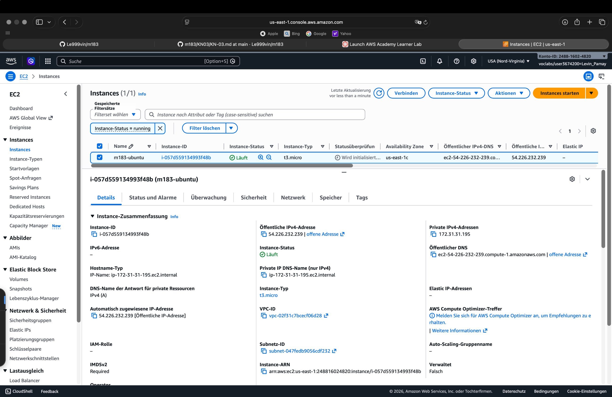

### 0.2 Eigene ISP-IP für Security Group ermitteln
Lokal `curl -4 ifconfig.me` → `213.55.241.21` (manuell in die Regeln eingetragen, nicht „My IP"-Autofill).

### 0.3 Security Group Inbound Rules (Port 80 + 443)
`m183-sg` Inbound Rules, alle Quellen `213.55.241.21/32`:

| Type  | Protocol | Port | Source |
|-------|----------|------|--------|
| SSH   | TCP | 22   | 213.55.241.21/32 |
| HTTP  | TCP | 80   | 213.55.241.21/32 |
| HTTPS | TCP | 443  | 213.55.241.21/32 |
| Custom TCP | TCP | 8080 | 213.55.241.21/32 |
| Custom TCP | TCP | 9000 | 213.55.241.21/32 |
| Custom TCP | TCP | 9090 | 213.55.241.21/32 |

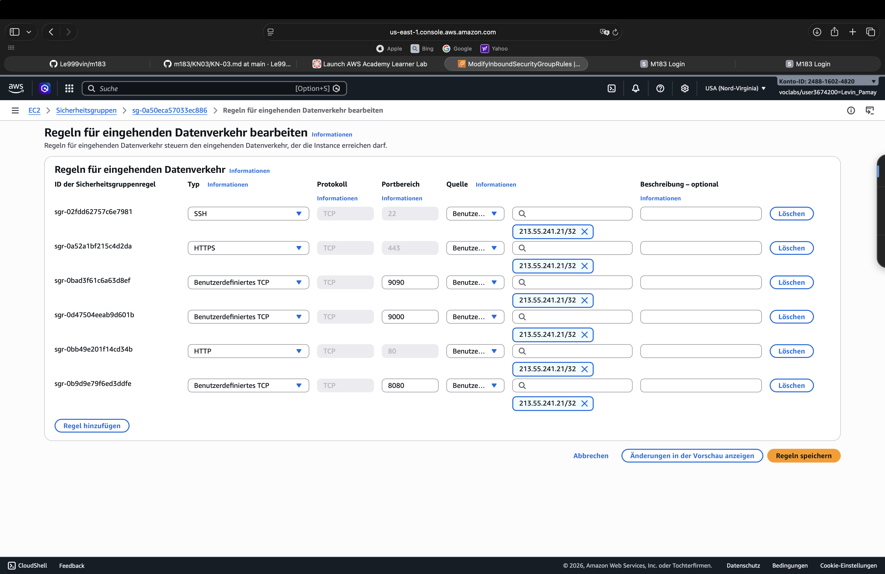

### 0.4 SSH-Verbindung & `docker ps`
```bash
ssh -i ~/Desktop/m183-key.pem ubuntu@54.226.232.239
sudo docker ps -a
df -h /
```

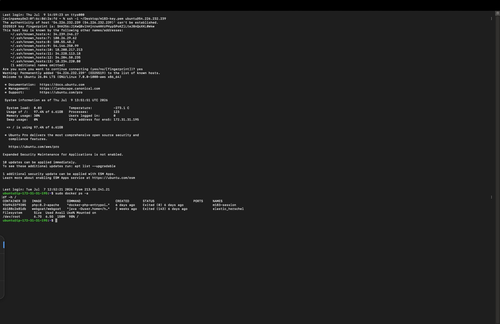

### 0.5 Speicher-Cleanup (Disk war bei 98 %)
Die t3.micro-Instanz hat nur ~6.6 GB. Vor dem Start alte Container/Images entfernt:

```bash
sudo docker rm m183-session elastic_herschel
sudo docker rmi webgoat/webgoat
sudo docker system prune -af
sudo apt clean && sudo journalctl --vacuum-time=1d
df -h /
```

Ergebnis: **98 % → 73 % (1.9 GB frei)**.

---

## A) Brute-Force-Angriff auf ein Web-Login

**Hintergrund:** Wie die Caesar-Chiffre einen winzigen Schlüsselraum hat (25 Schlüssel), ist auch ein schwaches Passwort einfach „durchprobierbar". Ein Angreifer feuert automatisiert Login-Requests mit einer Passwortliste ab, bis er trifft. Die App hat bewusst **kein Rate-Limiting und kein Account-Lockout**.

### A.1 – Verwundbare PHP-Login-App
`~/bruteforce-app/index.php` erstellt (Userdatenbank `admin` → `sunshine`, keine Schutzmassnahmen).

### A.2 – App mit Docker starten
```bash
sudo docker run -d --name bruteforce-app -p 80:80 \
  -v ~/bruteforce-app:/var/www/html php:8.2-apache
sudo docker ps
```
Container `bruteforce-app` läuft, Port `0.0.0.0:80->80/tcp`.

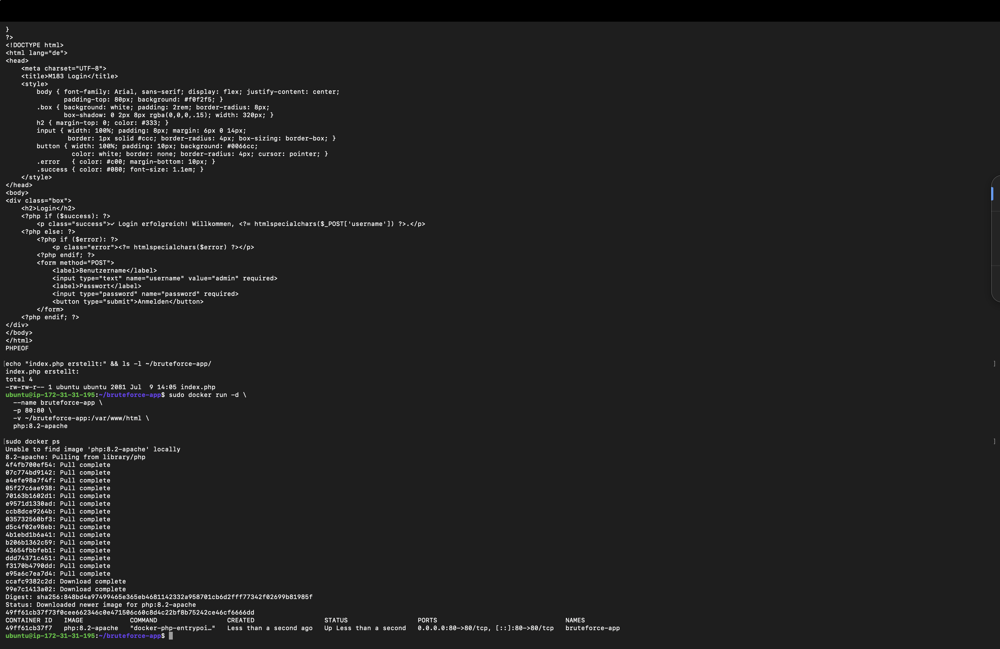

### A.3 – Login-Seite im Browser
`http://54.226.232.239` zeigt die Login-Maske. Falsches Passwort → Fehlermeldung, **keine Sperre**.

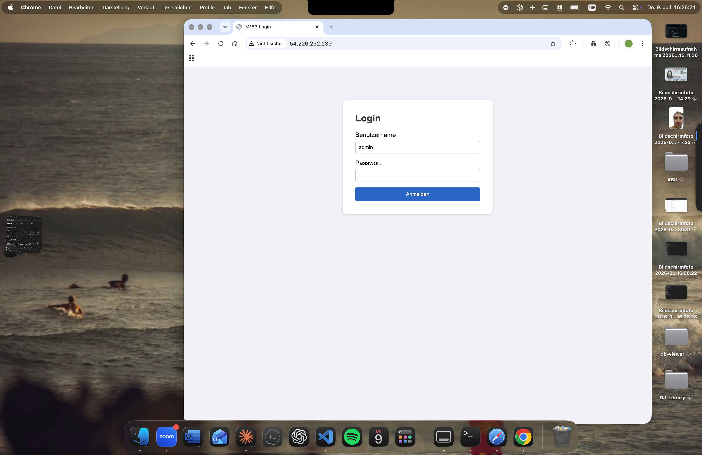

### A.4 – Passwortliste (`passwords.txt`)
20 gängige Passwörter, das echte (`sunshine`) versteckt darin.

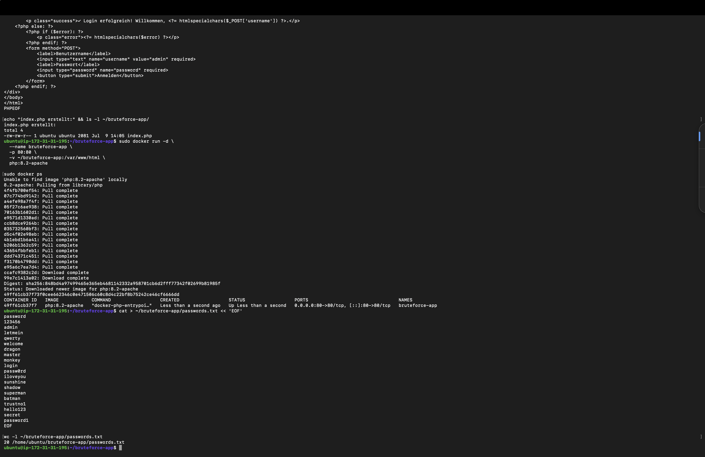

### A.5 – Brute-Force-Script (`brute.py`)
Iteriert über die Liste, POSTet je Login-Request, erkennt Treffer an Statuscode 200 + „erfolgreich".

### A.6 – Angriff & Verifikation
Der Angriff fand `sunshine` bei **Versuch 13 in 0.04 s**.

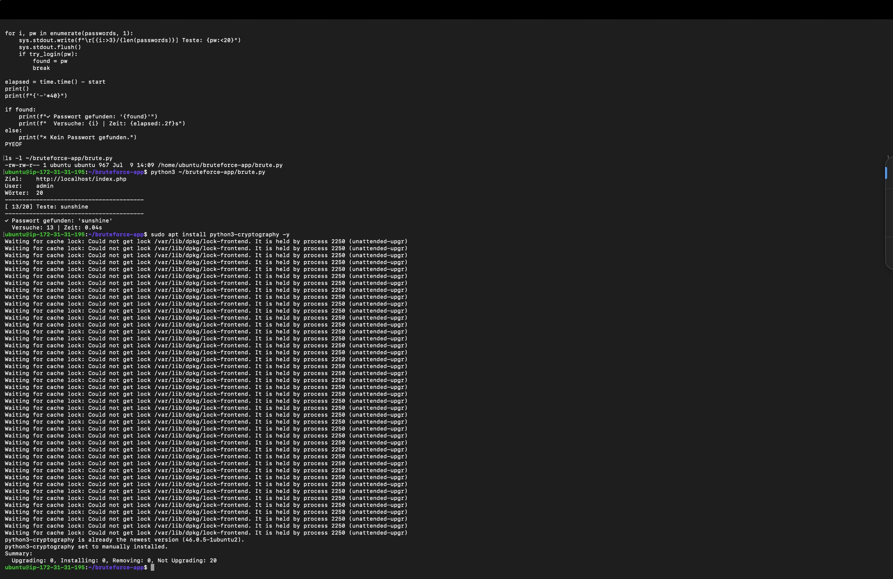

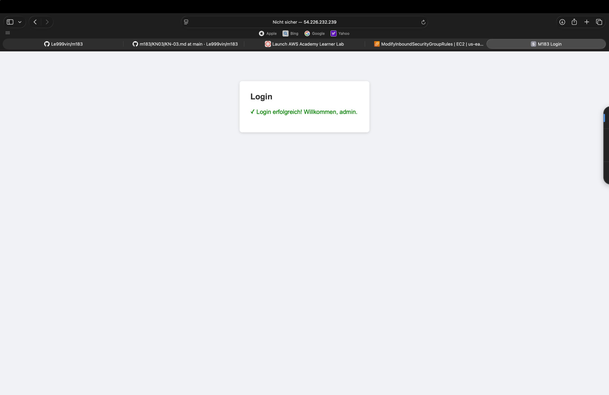

**Schriftliche Antworten:**

1. **Versuche/Zeit & 1 Mio. Liste:** Der Angriff fand `sunshine` nach **13 Versuchen in 0.04 Sekunden**. Das sind ~325 Versuche/Sekunde (13 / 0.04 s), begrenzt durch die HTTP-Round-Trip-Zeit, nicht durch das Passwort. Bei `rockyou.txt` (≈14 Mio. Einträge) und gleichem Tempo dauerte ein Vollscan im Worst Case ~14 Mio / 325 ≈ **12 Stunden** — bei paralleler Ausführung (mehrere Threads/Tools wie Hydra) nur Minuten. Entscheidend: Ohne Rate-Limiting/Lockout ist der Angriff **garantiert erfolgreich**, solange das Passwort in der Liste steht; die Listengrösse verschiebt nur die Zeit, nicht das Ergebnis.
2. **Zwei technische Massnahmen:** (a) **Rate-Limiting** (max. N Versuche pro Zeitfenster/IP) und (b) **Account-Lockout** nach mehreren Fehlversuchen. Zusätzlich sinnvoll: CAPTCHA, MFA, exponentielles Backoff. (Der PHP-Kommentar nennt genau Rate-Limiting + Account-Lockout.)
3. **Warum `sunshine` schwach ist:** Es ist ein einzelnes, kleingeschriebenes Wörterbuchwort ohne Ziffern/Sonderzeichen/Länge. Es steht in jeder gängigen Passwortliste (z. B. rockyou) und hat sehr geringe Entropie — dass es kein „offensichtliches" Passwort wie `123456` ist, hilft nicht, weil Wörterbuch-Angriffe ganze Sprachen/Namen/Begriffe abdecken.

## B) AES-256 symmetrische Verschlüsselung

**Hintergrund:** AES (2001, Nachfolger von DES) mit 256-Bit-Schlüssel im **GCM-Modus** liefert Vertraulichkeit **und** Integrität — Manipulation am Ciphertext wird beim Entschlüsseln erkannt.

### B.1 – Script `aes_demo.py`
Generiert 256-Bit-Key + 96-Bit-Nonce, verschlüsselt eine Nachricht, entschlüsselt sie, und testet Manipulation (erstes Byte kippen).

```python
import os
from cryptography.hazmat.primitives.ciphers.aead import AESGCM
key = AESGCM.generate_key(bit_length=256)
aesgcm = AESGCM(key)
nonce = os.urandom(12)
plaintext = b"Dies ist eine geheime Nachricht fuer M183!"
ciphertext = aesgcm.encrypt(nonce, plaintext, None)
# ... Ausgabe + decrypt + Manipulations-Test
```

### B.2 – Ausführung
Ausgabe (Beispiel-Lauf):
```
Klartext:         Dies ist eine geheime Nachricht fuer M183!
Schlüssel (hex):  9c4f4236e77b305e7ba4f9564a4c847abc2f10595a229e34df4a1af3ef15cc1d
Nonce (hex):      c1cc74f023e12e95e3e664be
Ciphertext (hex): e9f914dd8f3ff0d3fcb112cc879e31d83ffa9cf659acd8dfc028c1d0285c79f98...
Ciphertext-Länge: 58 Bytes
Entschlüsselt:    Dies ist eine geheime Nachricht fuer M183!
Manipulations-Test:
→ GCM-Modus hat die Manipulation erkannt!
```
> Hinweis: Bei jedem Lauf ändern sich Schlüssel und Nonce (frisch generiert). Die 42-Byte-Nachricht + 16-Byte-GCM-Tag = 58 Bytes Ciphertext.

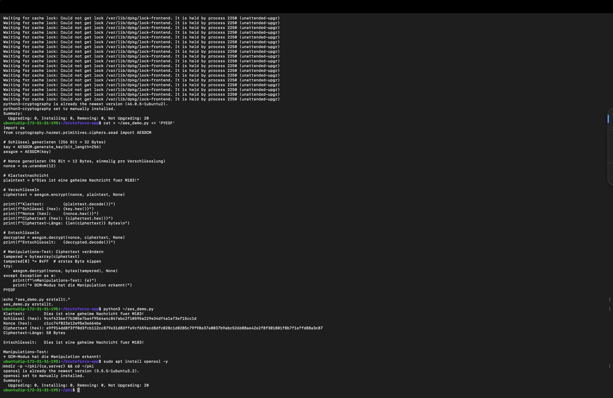

**Schriftliche Antworten:**

1. **Was ist ein Nonce, warum jedes Mal neu?** Ein Nonce („number used once") ist ein einmaliger Initialisierungswert (hier 96 Bit), der zusammen mit dem Schlüssel den Keystream bestimmt. Er muss pro Verschlüsselung mit demselben Schlüssel **einzigartig** sein: Wiederholt man Nonce + Key, entsteht derselbe Keystream, und ein Angreifer kann durch XOR zweier Ciphertexte Informationen über die Klartexte gewinnen — bei GCM bricht zusätzlich die Integritätsgarantie zusammen (Authentication-Key kann rekonstruiert werden). Der Nonce muss nicht geheim sein, nur einmalig.

2. **DES (56 Bit) vs. AES-256 – Brute-Force:** DES hat nur 2^56 ≈ 7.2·10^16 mögliche Schlüssel und ist heute in Stunden bis Tagen mit spezialisierter Hardware durchprobierbar. AES-256 hat 2^256 Schlüssel — das ist astronomisch grösser (2^200 ≈ 10^60-mal mehr). Selbst mit allen Computern der Welt wäre ein vollständiger Brute-Force-Durchlauf länger als das Alter des Universums. AES-256 ist damit praktisch brute-force-resistent.

3. **Manipulations-Test & GCM vs. CBC:** Der Test kippt das erste Byte des Ciphertexts; beim Entschlüsseln wirft GCM eine `InvalidTag`-Exception — die Manipulation wird **erkannt und die Entschlüsselung verweigert**. GCM ist ein AEAD-Verfahren (Authenticated Encryption), das neben Vertraulichkeit einen Authentication-Tag mitführt. Einfaches AES-CBC liefert nur Vertraulichkeit ohne Integritätsschutz: Ein Angreifer könnte Bits gezielt manipulieren (z. B. Bit-Flipping-Angriff), ohne dass es auffällt. GCM verhindert genau das.

## C) PKI-Zertifikatskette mit OpenSSL

**Hintergrund:** HTTPS/S-MIME nutzen eine hierarchische PKI. Vertrauenskette: **Root CA** (Vertrauensanker, fest im Browser) → **Server-Zertifikat**. Hier selbst nachgebaut.

### C.1 – CA & Verzeichnisse
`openssl` installiert (3.5.5), Ordner `~/pki/{ca,server}` angelegt.

### C.2 – Root CA
```bash
openssl genrsa -out ca/ca.key 4096
openssl req -new -x509 -days 3650 -key ca/ca.key -out ca/ca.crt \
  -subj "/C=CH/ST=Zuerich/O=TBZ-M183-CA/CN=M183 Root CA"
```

### C.3 – Server-Cert (CSR → von CA signiert)
```bash
openssl genrsa -out server/server.key 2048
openssl req -new -key server/server.key -out server/server.csr \
  -subj "/C=CH/ST=Zuerich/O=TBZ-M183/CN=$(curl -s ifconfig.me)"
openssl x509 -req -days 365 -in server/server.csr \
  -CA ca/ca.crt -CAkey ca/ca.key -CAcreateserial -out server/server.crt
cat server/server.crt ca/ca.crt > server/chain.crt
```

### C.4 – Prüfung
Zertifikat-Details:
```
Issuer:  C=CH, ST=Zuerich, O=TBZ-M183-CA, CN=M183 Root CA
Validity: Not Before Jul 9 14:20:07 2026 GMT / Not After Jul 9 14:20:07 2027 GMT
Subject: C=CH, ST=Zuerich, O=TBZ-M183, CN=54.226.232.239
Public Key: rsaEncryption (2048 bit)
Signature Algorithm: sha256WithRSAEncryption
```
Verifikation: **`server/server.crt: OK`** ✅

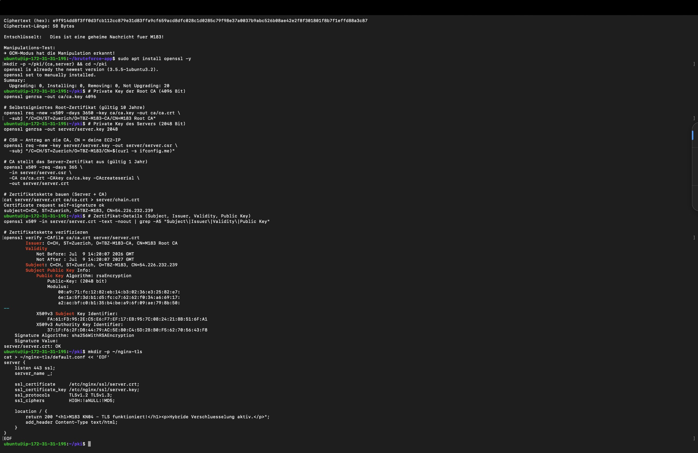


**Schriftliche Antworten:**

1. **Selbstsigniert vs. CA-signiert:** Ein **selbstsigniertes** Zertifikat wird mit dem eigenen privaten Schlüssel signiert — Aussteller (Issuer) und Inhaber (Subject) sind identisch, es gibt keinen unabhängigen Vertrauensanker (z. B. unsere Root CA `M183 Root CA`). Ein **CA-signiertes** Zertifikat (unser `server.crt`) wird vom privaten Schlüssel einer übergeordneten CA signiert; Issuer (`M183 Root CA`) ≠ Subject (`CN=54.226.232.239`). Nur wenn der Client der ausstellenden CA vertraut, vertraut er automatisch dem Server-Zertifikat.

2. **Was enthält ein CSR, wozu:** Ein Certificate Signing Request enthält den **öffentlichen Schlüssel** des Servers, die **Identitätsangaben** (Subject: Land, Organisation, CN/Hostname) und ist mit dem **privaten Serverschlüssel signiert** (Proof of Possession). Der **private Schlüssel verlässt den Server nie**. Der CSR ist der formale „Antrag" an die CA: Die CA prüft die Angaben und stellt daraufhin das signierte Zertifikat aus.

3. **Warum Browser nicht vertraut:** Der Browser vertraut nur Zertifikaten, deren Vertrauenskette bei einer **im Trust-Store hinterlegten Root-CA** endet. Unsere `M183 Root CA` ist nirgends eingetragen — sie ist keine öffentlich anerkannte CA (kein Audit, kein Programm wie das von Mozilla/Microsoft/Apple). Technisch ist das Zertifikat korrekt (gültige Signatur, gültige Daten), aber ohne bekannten Vertrauensanker meldet der Browser „nicht vertrauenswürdig" (`NET::ERR_CERT_AUTHORITY_INVALID`).

## D) Nginx mit TLS konfigurieren

**Hintergrund:** HTTPS ist ein **hybrides Verfahren**: asymmetrische Krypto (RSA/ECDH) für den sicheren Schlüsselaustausch, danach symmetrische Krypto (AES) für die Datenübertragung.

### D.1 – Nginx-TLS-Config & Container
Config auf dem Host erstellt und in `nginx:alpine` gemountet (sauberer als `docker exec`-Heredoc):
```bash
# ~/nginx-tls/default.conf: listen 443 ssl; ssl_certificate chain.crt; ...
sudo docker run -d --name nginx-tls -p 443:443 \
  -v ~/pki/server/chain.crt:/etc/nginx/ssl/server.crt:ro \
  -v ~/pki/server/server.key:/etc/nginx/ssl/server.key:ro \
  -v ~/nginx-tls/default.conf:/etc/nginx/conf.d/default.conf:ro \
  nginx:alpine
```
Interner Test: `curl -k https://localhost/` → `<h1>M183 KN04 - TLS funktioniert!</h1>` ✅

> **Troubleshooting (dokumentiert):** Extern kam zuerst „Connection timed out" auf Port 443. Ursache: Die HTTPS-443-Inbound-Rule war in der Security Group zwar eingetippt, aber **nie mit „Regeln speichern" committet** (Port 80 lief noch aus einer früheren Session). Nach dem Speichern der Regel war Port 443 sofort erreichbar. → Lehre: SG-Änderungen immer explizit speichern; „Connection timed out" (statt „refused") deutet auf geblockten Port/SG hin.

### D.2 – Im Browser
`https://54.226.232.239` → Sicherheitswarnung (selbstsignierte Root-CA), nach „Weiter" erscheint die TLS-Seite. Chrome zeigt „Nicht sicher" + durchgestrichenes `https`.

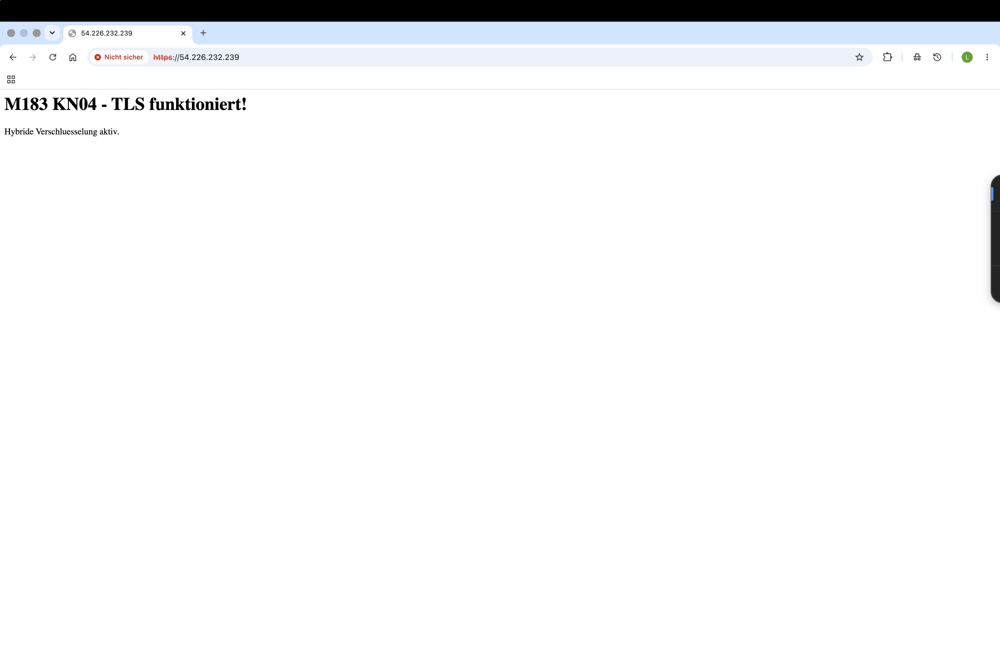

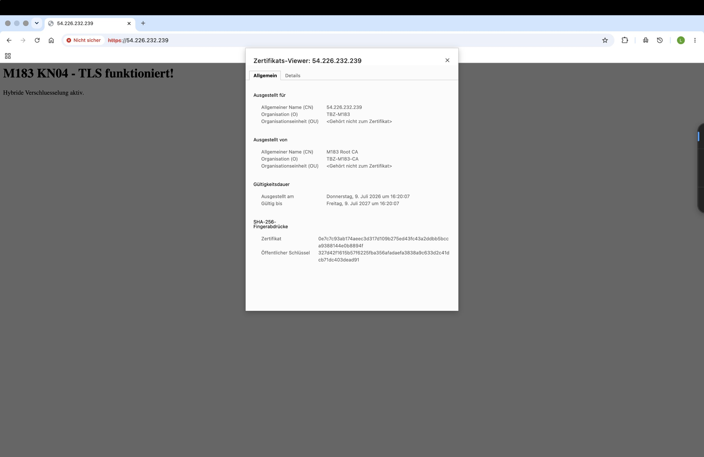

**Schriftliche Antworten:**

1. **Welche Infos zeigt der Zertifikat-Dialog, was davon aus Aufgabe C:** Der Browser zeigt CN/Subject (`54.226.232.239`), Aussteller/Issuer (`M183 Root CA`), Gültigkeitszeitraum (Jul 2026 – Jul 2027), Public-Key-Algorithmus (RSA 2048) und Signaturalgorithmus (SHA-256). **Selbst definiert in Aufgabe C** habe ich: den Subject (C/ST/O/CN via `-subj`), den Issuer (die Root-CA `M183 Root CA`), die Gültigkeitsdauer (`-days 365`) und die Schlüssellänge (2048 Bit).

2. **Warum trotz korrektem Zertifikat eine Warnung:** Weil unsere selbst erstellte Root-CA nicht im Trust-Store des Browsers hinterlegt ist. Die Vertrauenskette endet bei einer unbekannten CA → der Browser kann die Echtheit nicht über einen anerkannten Vertrauensanker bestätigen und warnt (`ERR_CERT_AUTHORITY_INVALID`), obwohl Signatur und Daten technisch gültig sind.

3. **Hybride Verschlüsselung bei HTTPS (anhand dieses Setups):** Beim TLS-Handshake authentifiziert sich der Server mit seinem **Zertifikat** (enthält den öffentlichen RSA-Schlüssel aus Aufgabe C). Über **asymmetrische** Verfahren (RSA-Key-Transport bzw. ECDHE-Key-Exchange) wird ein gemeinsames **Session-Geheimnis** sicher ausgehandelt, ohne dass ein Angreifer es mitlesen kann. Aus diesem Geheimnis wird ein **symmetrischer** Sitzungsschlüssel abgeleitet. Die eigentlichen Nutzdaten (HTTP-Requests/Responses) werden dann schnell und effizient mit **AES** symmetrisch verschlüsselt (`ssl_ciphers HIGH`). Also: asymmetrisch nur für den Schlüsselaustausch, symmetrisch für die Datenübertragung.

## E) HTTP vs. HTTPS – Traffic live mitlesen

**Setup:** Zwei Dienste laufen gleichzeitig — Port 80 (PHP-Login, unverschlüsselt) und Port 443 (Nginx TLS, verschlüsselt). Mit `nmap` zeigen wir offene Ports, mit `tcpdump` was ein Angreifer sieht.

### E.1 – nmap Port-Scan
```bash
sudo apt install nmap tcpdump -y
nmap -sV localhost
```
Ergebnis: Port 22 `ssh` (OpenSSH), Port 80 `http` (Apache 2.4.67), Port 443 `ssl/http` (nginx 1.31.2).


**Antwort Frage 1:** nmap zeigt für Port 80 den Dienst `http` (Apache) und für Port 443 `ssl/http` (nginx). Ein Angreifer erfährt allein durch den Port-Scan — **bevor** er eine einzige Anfrage an die App stellt — welche **Dienste und Versionen** laufen (Server-Software, Version), welche **Ports offen** sind und wo **verschlüsselt (443) vs. unverschlüsselt (80)** kommuniziert wird. Das ermöglicht gezielte Angriffe auf bekannte Schwachstellen dieser konkreten Versionen (Fingerprinting / Reconnaissance).

### E.2 – tcpdump Port 80 (HTTP, Klartext)
Terminal 1: `sudo tcpdump -i any -A port 80 2>/dev/null`
Terminal 2: `curl -s -o /dev/null -X POST http://localhost/ -d "username=admin&password=sunshine"`

Im tcpdump-Output erscheint der komplette Request inkl. `username=admin&password=sunshine` **im Klartext** (`POST / HTTP/1.1 … Content-Type: application/x-www-form-urlencoded … username=admin&password=sunshine`).

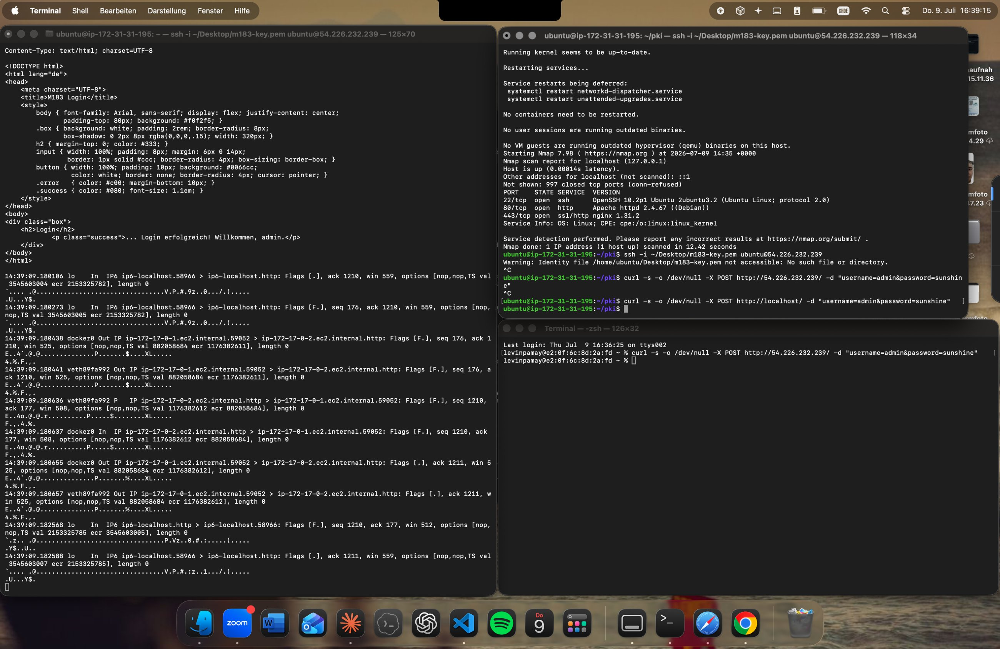


**Antwort Frage 2:** Sichtbar ist der gesamte HTTP-Request: Methode (`POST /`), Host-Header, Content-Type und der **Request-Body** `username=admin&password=sunshine`. Die Zeile mit `password=sunshine` enthält das Passwort im Klartext — vollständig mitlesbar.

**Antwort Frage 3:** In einem realen Netzwerk müsste der Angreifer sich **in den Datenpfad** zwischen Opfer und Server bringen (Man-in-the-Middle). Klassisch per **ARP-Spoofing** (dem Opfer vorgaukeln, der Angreifer sei das Gateway), alternativ über einen kompromittierten Switch/Router, Rogue-WLAN-Access-Point oder DNS-Spoofing. Dann leitet er den Traffic über sich um und liest ihn wie hier mit tcpdump mit.

### E.3 – tcpdump Port 443 (HTTPS, Ciphertext)
Terminal 1: `sudo tcpdump -i any -A port 443 2>/dev/null`
Terminal 2: `curl -s -o /dev/null -k -X POST https://localhost/ -d "username=admin&password=sunshine"`

Diesmal **kein lesbarer Text** — nur TLS-Handshake-Bytes und Ciphertext. Kein Benutzername, kein Passwort (nur `localhost` als SNI im ClientHello).

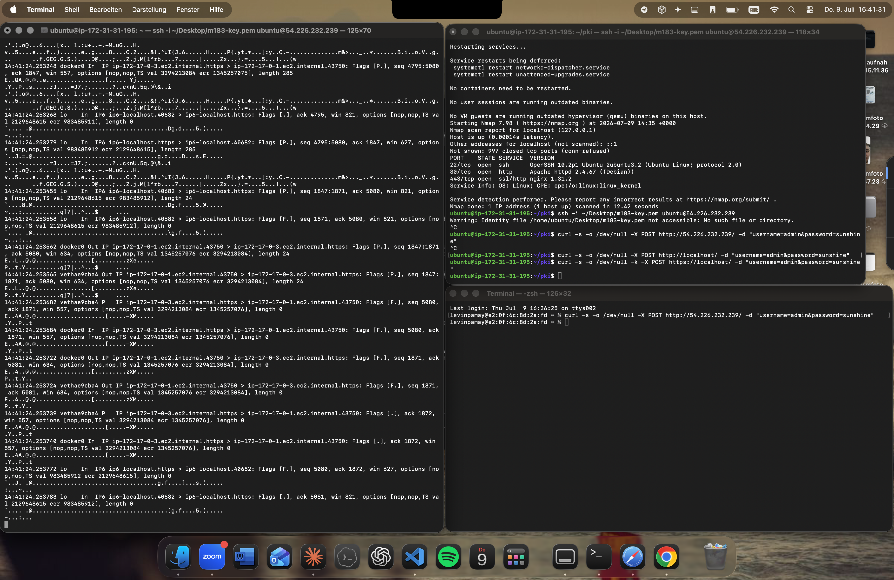

**Antwort Frage 4:** Auf Port 80 ist der Payload als ASCII-Klartext lesbar (inkl. Passwort). Auf Port 443 sieht der Angreifer nur den **verschlüsselten TLS-Record** — zufällig aussehende Bytes. Er erkennt, *dass* eine TLS-Verbindung besteht, aber **nicht deren Inhalt**: kein Benutzername, kein Passwort, keine URL/Pfad.

**Antwort Frage 5:** Vor der Datenübertragung läuft der **TLS-Handshake** (hybride Verschlüsselung aus Aufgabe D): Server sendet sein Zertifikat (Authentifizierung), Client prüft es, dann wird per **asymmetrischem** Verfahren (RSA/ECDHE) ein gemeinsames Session-Geheimnis ausgehandelt und daraus ein **symmetrischer** Sitzungsschlüssel abgeleitet. Erst danach werden die Nutzdaten (Benutzername/Passwort) mit diesem AES-Schlüssel verschlüsselt übertragen.

**Antwort Frage 6:** Die **IP-Adressen** stehen im **IP-Header** (Layer 3), der für das Routing durchs Netz zwingend unverschlüsselt sein muss — sonst wüsste kein Router, wohin das Paket soll. TLS verschlüsselt nur den **Payload** (Layer 4+, die Anwendungsdaten), nicht die Transport-/Netzwerk-Header. Deshalb bleiben Quell- und Ziel-IP (sowie Ports) auch bei HTTPS sichtbar — ein Angreifer sieht *wer mit wem* kommuniziert, aber nicht *was*.

## F) Hash-Funktionen: MD5 cracken mit Python

**Hintergrund:** MD5 gilt für Passwörter als unsicher — nicht nur wegen Kollisionen, sondern weil es **extrem schnell** ist (Milliarden Hashes/s möglich). Eine gestohlene MD5-DB lässt sich per Wörterbuch in Sekunden knacken.

### F.1 – Simulierte gestohlene Hash-DB (`hashes_md5.txt`)
6 User mit MD5-gehashten Passwörtern (Format `user:hash`), z. B. `alice:0571749e...`, `frank:e9f5bd2b...`.

### F.2 – Cracker-Script (`crack_md5.py`)
Pfade an unsere Umgebung angepasst: `HASHFILE=/home/ubuntu/hashes_md5.txt`, `WORDLIST=/home/ubuntu/bruteforce-app/passwords.txt`. Hasht jedes Wort mit MD5 und vergleicht mit den Ziel-Hashes.

### F.3 – Angriff (20-Wörter-Liste)
Ergebnis:
```
✓ dave    0d107d09f5bbe40cade3de5c71e9e9b7  →  'letmein'
✓ bob     8621ffdbc5698829397d97767ac13db3  →  'dragon'
✓ carol   f25a2fc72690b780b2a14e140ef6a9e0  →  'iloveyou'
✓ alice   0571749e2ac330a7455809c6b0e7af90  →  'sunshine'
Geknackt: 4/6 | Zeit: 0.1 ms | Hashes/Sekunde: 146,911
```
Geknackt: alice, bob, carol, dave. **Nicht** geknackt: eve, frank.

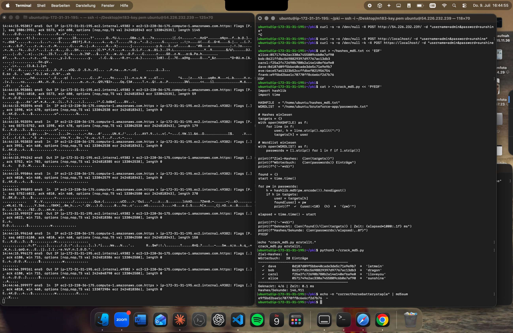

### F.4 – Warum ist frank sicher?
```bash
echo -n "correcthorsebatterystaple" | md5sum
# → e9f5bd2bae1c70770ff8c6e6cf2d7b76   (= franks Hash, exakt)
```
Franks Passwort ist `correcthorsebatterystaple` — lang, aber technisch trotzdem ein MD5-Hash; es fehlt nur die passende Wortliste.

**Schriftliche Antworten (Schritt 4):**

1. **Geknackt vs. nicht:** Geknackt wurden alice (`sunshine`), bob (`dragon`), carol (`iloveyou`), dave (`letmein`) — alles kurze, gängige **Wörterbuchwörter**, die in der Liste stehen. Frank (`correcthorsebatterystaple`) wurde nicht geknackt, weil sein Passwort **lang** ist und **in keiner Standard-Wortliste** vorkommt. Der Unterschied ist nicht die „Stärke" des MD5-Hashes, sondern ob das Klartextwort in der Angriffsliste steht.

2. **Hochrechnung rockyou.txt:** Bei gemessenen ~146'900 Hashes/Sekunde (reines Python) bräuchte `rockyou.txt` (14 Mio. Einträge) rechnerisch 14'000'000 / 146'900 ≈ **~95 Sekunden**. Mit optimierten Tools (hashcat auf GPU: Milliarden Hashes/s) wäre dieselbe Liste in **Sekundenbruchteilen** durch. MD5 bietet also praktisch keinen Zeitschutz.

3. **Zwei Massnahmen, die gestohlene Hashes unbrauchbar machen:** (a) **Salt** — ein pro Benutzer zufälliger Wert, der vor dem Hashen angehängt wird; damit sind Rainbow-Tables nutzlos und jeder Hash muss einzeln angegriffen werden. (b) **Langsamer, rechenintensiver Algorithmus** (Argon2ID / scrypt / bcrypt) statt MD5 — bewusst so gestaltet, dass ein einzelner Hash Millisekunden bis Sekunden kostet, was Massen-Cracking praktisch unmöglich macht.

### F.5 – Erweiterte Wortliste
`passwords.txt` um 10 weitere Passwörter (30 total) ergänzt, Angriff erneut gestartet. Ergebnis: weiterhin **4/6** — auch eve wird nicht geknackt, weil ihr Passwort in keiner der Listen steht. Das zeigt: mehr Wörter helfen nur, wenn das gesuchte Passwort tatsächlich in der Liste vorkommt.

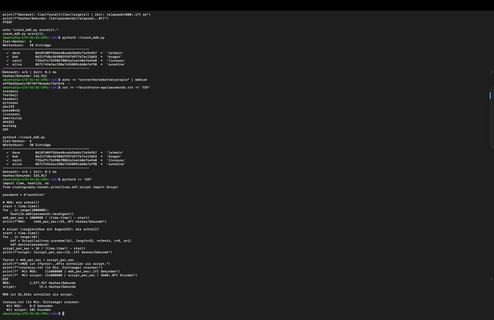

### F.6 – Argon2ID/scrypt schlägt MD5
Timing-Vergleich (gemessen auf der Instanz):
```
MD5:    1,577,927 Hashes/Sekunde
scrypt:        19.4 Hashes/Sekunde
→ MD5 ist 81,522x schneller als scrypt.

rockyou.txt (14 Mio. Einträge) cracken:
  Mit MD5:      8.9 Sekunden
  Mit scrypt:   201 Stunden
```
Das ist der Kern: Ein bewusst **langsamer** Algorithmus (scrypt/Argon2ID) macht Massen-Cracking von 14 Mio. Kandidaten von Sekunden (MD5) auf über eine Woche (201 h) — praktisch unbrauchbar für Angreifer.


---

## Abgabe-Zusammenfassung

| Aufgabe | Inhalt | Status |
|---------|--------|--------|
| A | Brute-Force gegen Web-Login (`sunshine`, 13 Versuche, 0.04 s), Gegenmassnahmen | ✅ |
| B | AES-256-GCM Ver-/Entschlüsselung + Manipulationsschutz | ✅ |
| C | PKI-Zertifikatskette (Root CA → Server), `verify: OK` | ✅ |
| D | Nginx mit TLS, hybride Verschlüsselung, Zertifikat-Dialog | ✅ |
| E | nmap-Scan + tcpdump Port 80 (Klartext) vs. 443 (Ciphertext) | ✅ |
| F | MD5-Cracking (4/6), frank sicher, MD5 vs. scrypt (81'522×) | ✅ |

## Screenshot-Status

**Bereits eingebettet (in `screenshots/`):**

| Datei | Zeigt |
|-------|-------|
| `00_ec2_instance.png` | EC2-Instanz-Übersicht mit Public IPv4 (Setup 0.1) |
| `00_ssh_docker.png` | SSH-Verbindung, `docker ps -a`, `df -h /` (Setup 0.4) |
| `00_security_group.png` | Security Group Inbound Rules (Setup 0.3) |
| `A0_docker_setup.png` | docker run + `docker ps` (A.2) |
| `A1_login_seite.png` | Login-Seite im Browser (A.3) |
| `A0_passwords.png` | passwords.txt erstellen (A.4) |
| `A2_brute_output.png` | Brute-Force-Ausgabe mit `sunshine` (A.6) |
| `A3_login_erfolg.png` | Erfolgreicher Browser-Login als `admin` (A.6) |
| `B1_aes_output.png` | AES-256-GCM-Ausgabe inkl. Manipulations-Test (B.2) |
| `C1_cert_details.png` | `openssl x509 -text` mit Subject/Issuer/Validity (C.4) |
| `C2_verify_ok.png` | `openssl verify` mit `OK` (C.4) |
| `D1_tls_seite.png` | TLS-Seite im Browser (D.2) |
| `D2_zertifikat_dialog.png` | Zertifikat-Viewer mit CN, CA und Gültigkeit (D.2) |
| `E1_nmap.png` | nmap-Scan (E.1) |
| `E2_tcpdump_80.png` | tcpdump Port 80, Klartext-Passwort (E.2) |
| `E2b_curl_80.png` | curl-Befehl für HTTP POST (E.2) |
| `E3_tcpdump_443.png` | tcpdump Port 443, Ciphertext (E.3) |
| `F1_crack_output.png` | crack_md5.py-Ausgabe mit 20-Wörter-Liste (F.3) |
| `F2_crack_erweitert.png` | crack_md5.py mit 30-Wörter-Liste (F.5) |
| `F3_scrypt_vergleich.png` | MD5-vs-scrypt-Vergleich (F.6) |

**Offene Screenshot-Platzhalter:** Keine.

## Leitfragen / Checkpoints (erfüllt)

- Brute-Force gegen Web-Login erklärt; zwei Gegenmassnahmen (Rate-Limiting, Account-Lockout) ✅
- Symmetrisch (AES-256-GCM) durchgeführt; Key/Nonce/GCM-Integrität erklärt ✅
- Asymmetrisch & hybride Verschlüsselung (HTTPS/TLS-Handshake) erklärt ✅
- PKI-Kette mit OpenSSL erstellt & verifiziert; CSR und CA-Rolle erklärt ✅
- nmap: offene Ports/Dienste identifiziert ✅
- HTTP-Klartext vs. HTTPS-Ciphertext mit tcpdump demonstriert; IP-Header trotz TLS sichtbar erklärt ✅
- MD5 unsicher für Passwörter demonstriert; Salt + langsamer Algorithmus als Schutz genannt ✅
